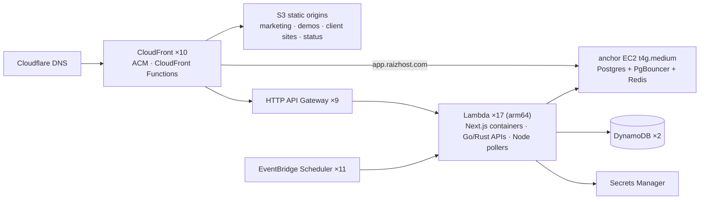
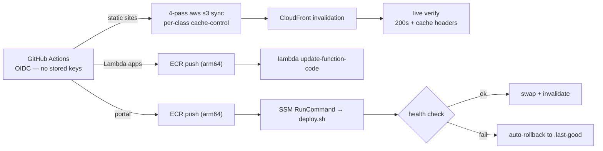

# RaizHost Architecture

**How a one-person web agency runs ~10 production sites and 3 web apps on AWS for about $50/month.**

[RaizHost](https://raizhost.com) designs, builds and hosts websites for local businesses — detailers,
contractors, restaurants, salons. The pitch is *"protection, built in"*: fast static sites that are
accessible (WCAG 2.1 AA), have no CMS plugins to exploit, and ship with the legal pages already done.

The application source stays private. This repo is the **public architecture record**: what the
platform runs on, why each piece was chosen, what it costs, and how it is operated day to day.

---

## The diagram

  

Hand-drawn SVG with Inter embedded; [`diagrams/check.py`](diagrams/check.py) verifies in CI that every label fits its box and no line crosses text. Mermaid sketch: [`diagrams/architecture.mmd`](diagrams/architecture.mmd). Detailed flows: [request path](docs/request-flow.md) · [deploy path](docs/deploy-flow.md) · [client provisioning](docs/client-provisioning.md) · [decision log](docs/decisions.md).

## Design principles

The platform was a **re-imagining, not a lift-and-shift** of the ~27-container Hetzner VPS it
replaced. Two facts drove every choice: a **$100/month hard ceiling**, and the goal that
**nothing should cost money while idle**.

| Principle | What it means in practice |
|:--|:--|
| **Scale-to-zero by default** | Anything request- or event-driven is serverless: CloudFront + S3, HTTP API Gateway + Lambda, DynamoDB on-demand, EventBridge Scheduler. Idle cost ≈ $0. |
| **One always-on box, as small as possible** | A single `t4g.medium` Graviton "anchor" is the only hourly-billed compute. It holds what genuinely can't scale to zero: the consolidated Postgres, Redis, NAT for in-VPC Lambdas, and the stateful client portal. |
| **No NAT Gateway, no load balancer** | ~$32 and ~$18/mo of pure idle cost. The anchor NATs for the private subnets; API Gateway is the pay-per-request front door. |
| **Right service for the access pattern** | Leads/quotes/CRM are key-value → DynamoDB. Relational apps share one Postgres with many databases. A 40-minute batch job goes to Fargate Spot, not a warm container. |
| **arm64 everywhere** | Every Lambda and both EC2 instances are Graviton. Cheaper per unit, and the container images are built arm64 in CI. |
| **Infrastructure as code, with a human gate** | ~330 resources in Terraform. Day-to-day client provisioning runs through idempotent scripts that **plan by default** and mutate only with an explicit `--execute` that trips an approval prompt. |
| **No long-lived credentials** | GitHub Actions assumes deploy roles via OIDC. Shell access is SSM Session Manager — no open SSH port anywhere. |
| **Egress is the budget risk** | Hetzner bundled ~20 TB; AWS meters every GB. Budget alarms at 50/80/100% were the *first* resources created, before anything that could spend. |

## What we use, and why

| Layer | Choice | Why this and not the obvious alternative |
|:--|:--|:--|
| **DNS** | **Cloudflare** (DNS-only CNAMEs to CloudFront) | Free DNSSEC, email routing and origin hiding that Route 53 doesn't give; cutover is a single record swap with instant rollback. Route 53 is used **only** for health checks. |
| **Edge / TLS** | **CloudFront** ×10, PriceClass_100, ACM certs | One distribution per public hostname. CloudFront Functions handle trailing-slash canonicalization and bot blocking at the edge, so bad traffic never reaches an origin or a bill. |
| **Static sites** | **S3** origins behind Origin Access Control | The product *is* a fast static site. `aws s3 sync` + invalidation is the whole deploy. A four-pass sync sets distinct `cache-control` per asset class (hashed assets immutable for a year, HTML `must-revalidate`). |
| **Dynamic apps** | **HTTP API Gateway** + **Lambda container images** (Next.js via Lambda Web Adapter; Go/Rust zip functions for small APIs) | HTTP APIs cost a fraction of REST APIs and replace an ALB. Container-image Lambdas let the same Dockerfile run locally and in prod. `s-maxage` on responses lets CloudFront serve HTML in ~50 ms. |
| **Relational data** | **One Postgres + PgBouncer on the anchor** | Seven separate Postgres containers became one instance with many databases. RDS + ElastiCache for the same workload starts at ~$60/mo; the anchor is ~$25 all-in. Aurora Serverless v2 was evaluated and rejected for this shape. |
| **Key-value data** | **DynamoDB** on-demand, PITR on | Quote capture and the sales CRM are append-mostly and tiny; DynamoDB is near-free and removes load from the anchor. |
| **Client portal** | **Docker on the anchor** behind CloudFront (`app.raizhost.com`) | The portal is stateful (uploads, background site builds, publish to S3). It started on Lambda and was moved to the anchor once that stopped fitting — Lambda stayed as a one-flip rollback for a week, then was retired. |
| **Scheduling** | **EventBridge Scheduler** ×11 | Pollers, nightly jobs, and the stop/start schedule for the ops box. Cron with IAM, no host to keep alive. |
| **Container registry** | **ECR** ×7, keep-last-5 lifecycle | Enough history to roll back; storage never grows unbounded. |
| **Observability** | **CloudWatch** alarms + **Route 53 health checks** → **SNS** email; public status page | Replaced a self-hosted Prometheus/Grafana/Loki/Tempo stack that cost more to keep warm than the apps it watched. Every client site gets its own health check + uptime alarm at provisioning time. |
| **Backups** | Nightly `pg_dumpall` → S3; DLM EBS snapshots (7-day); S3 versioning on site and contract buckets | Cheap, boring, restorable across accounts (EBS snapshots aren't — learned during the account migration). |
| **Email** | **Resend** for transactional mail | SES stayed in sandbox (production access denied for a new account), which blocked client contact forms. Resend was live in an afternoon. |
| **Revenue** | **Stripe** payment links + subscriptions; **SignWell** e-signature | E-sign first, then the payment link. Signed agreements land in a versioned, never-expiring S3 bucket. |
| **IaC** | **Terraform** (S3 backend with native locking, per-account tfvars, `allowed_account_ids` guard) | A wrong-account apply fails at plan time. Per-app stacks compose reusable modules (`static-site`, `lambda-container-app`, `scheduled-lambda`, `budget-guardrail`, …). |
| **Legacy** | Hetzner VPS, read-only | Kept as a rollback shadow while the last community zone migrates; then decommissioned. |

Deliberately **absent**: RDS, ElastiCache, NAT Gateway, ALB/ELB, ECS/Fargate services, Amplify,
Kubernetes, GuardDuty/Security Hub (evaluated; not worth their idle cost at this scale).

## Request flow

## Deploy flow

## A client's lifecycle through the platform

1. **Quote** — the form on raizhost.com posts to a throttled HTTP API → Node Lambda → DynamoDB (with MX-checked, disposable-blocked address validation and double opt-in for the newsletter). An ack goes out through Resend.
2. **Close** — a SignWell agreement, then a Stripe payment link. The signed PDF and audit certificate are archived to S3.
3. **Provision** — `new-client-site --slug <x> --domain <y>` plans, then on `--execute` creates: versioned S3 bucket → ACM cert → Cloudflare validation + site CNAMEs → per-client CloudFront Function + OAC + distribution → scoped bucket policy → Route 53 health check → CloudWatch uptime alarm. Re-runnable; existing resources are detected and skipped. ([details](docs/client-provisioning.md))
4. **Edit** — the client edits content in `app.raizhost.com`; a publish writes the built site to S3 and issues one invalidation. Live in 2–3 minutes; git history is the version history.
5. **Operate** — every site is health-checked every 30 s; failures page by email; the public status page shows fleet state.

## What it costs

| Slice | $/month | Notes |
|:--|--:|:--|
| Anchor EC2 `t4g.medium` + EBS + EIP | ~$32 | The only always-on compute |
| Lambda + API Gateway + CloudFront + S3 + DynamoDB | ~$3–10 | Mostly inside free tier at current traffic |
| Secrets Manager, ECR, CloudWatch, Config, snapshots | ~$8–10 | Config recorder is the one line under review |
| **Core platform total** | **~$50** | Serves every public surface |
| Ops box `t4g.large` (agent sessions + QA lab) | ~$40 | On a 07:00–24:00 PT schedule; was ~$57 at 24/7 |

Two AWS Budgets alarm at the $100 ceiling. The one real cost incident: the ops box was
hand-launched outside Terraform and ran 24/7, doubling the bill from the documented ~$50 to
~$106. Fix was three EventBridge schedules (evening start / nightly stop / morning start) applied
through the same gated-script pattern as everything else — and the lesson that the first
schedule pair silently missed a morning start, so the box was off 20 h/day instead of 7.

## Operating the platform

Operations live in a private `raizhost-operations` repo that is both the knowledge base and the
**agent system** the platform is run with:

- **Knowledge base as canon.** Every live-system fact has exactly one home. The AWS map carries a
  *"last verified / verify by"* header; a doc past its date is a claim, not a fact, until re-checked
  against a read-only AWS sweep (`infra-truth-check`).
- **Specialized agents, not one big prompt.** ~18 Claude Code subagents — foreman, demo-builder,
  demo-critic, mobile-qa, fact-checker, infra-truth-check, doc-steward, lead-scout, and so on — each
  own one job. A second engine (Codex) shares the same skill files through a quota-aware router.
- **A guard hook, not a wiki rule.** A `PreToolUse` hook classifies every command. Deploys,
  DNS writes, VPS writes, git pushes and anything that moves money surface as an explicit
  in-session approval prompt; read-only work runs free. "If a rule is worth having it is worth
  checking — and if it cannot be checked, it is advice."
- **A mechanical quality gate.** A Playwright-driven QA lab (Chromium + WebKit) renders every page
  at 375 / 412 / 430 px and asserts the design contract — contrast, tap targets, fonts actually
  loaded, zero console errors, LCP budget — before anything client-facing ships.
- **Plan-by-default automation.** Provisioning and site-update scripts are idempotent
  check-then-create against live AWS. The default run prints the mutation manifest; `--execute`
  is one approval per run.

## Lessons learned

- **SES sandbox is a real product risk for a new account.** Production access was denied; client
  contact forms couldn't email. Moving to Resend took an afternoon and should have been day one.
- **Lambda Function URLs 403'd on every request** with a correct public policy; an HTTP API in
  front of the same function worked immediately. Just use API Gateway.
- **CloudFront cache keys are shared across behaviors.** Mounting `/demos/` on the marketing
  distribution collided with the homepage's `/index.html` key — last writer won. A custom cache
  policy keyed on an internal query-string discriminator made the keys disjoint.
- **Cache-control must be set on upload.** With none set, browsers heuristically revalidated
  every asset and the site felt "clunky". The four-pass sync fixed it; LCP went 1,172 ms → 372 ms.
- **Anything outside Terraform will bite you.** The unmanaged ops box doubled the bill; every
  script now writes a `terraformImport` map so ad-hoc resources can be adopted later.
- **A migration is a rewrite opportunity.** Porting the Hetzner box container-for-container would
  have cost $200–700/mo. Re-imagining it for scale-to-zero landed at ~$50.

## Related public work

- [sre-reference-app](https://github.com/JadenRazo/sre-reference-app) — the ECS Fargate / SLO / chaos-drill blueprint this platform deliberately did *not* need.
- [llm-tracker](https://github.com/JadenRazo/llm-tracker) — one of the apps running on this platform (`llm.raizhost.com`).
- [CloudCostMCP](https://github.com/JadenRazo/CloudCostMCP) — prices Terraform plans before apply; born from the budget-ceiling mindset above.

---

Documentation © Jaden Razo, licensed <a href="LICENSE">CC BY 4.0</a>. Application source, Terraform and the operations knowledge base are private. Numbers reflect the platform as of August 2026.
