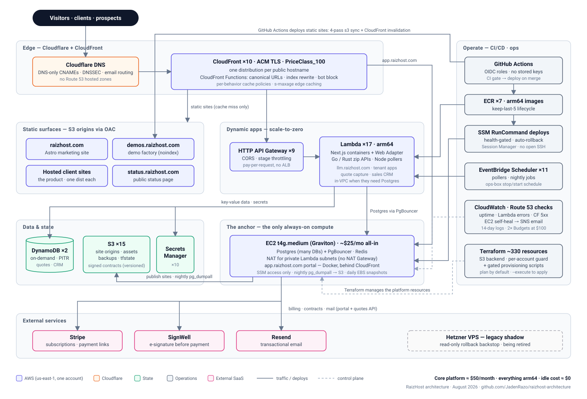

# RaizHost Architecture

**How a one-person web agency runs a serverless-first web platform and a
source-controlled client-site pipeline under a $100 AWS ceiling.**

[RaizHost](https://raizhost.com) designs, builds and hosts websites for local businesses — detailers,
contractors, restaurants, salons. The pitch is *"protection, built in"*: fast static sites that are
accessible (WCAG 2.1 AA), have no CMS plugins to exploit, and ship with the legal pages already done.

The application source stays private. This repo is the **public architecture record**: what the
platform runs on, why each piece was chosen, what it costs, and how it is operated day to day.

> **Current as of 2026-08-30.** The serving core is still modeled at about $50/month, but that is
> not the whole AWS bill. The scheduled operations box brings the expected business-account total
> to roughly **$90-95/month**; a clean post-schedule billing re-measure is still open. See the
> [dated current-state record](docs/current-state.md) for what is serving, transitioning, disabled,
> and awaiting verification.

---

## The diagram

  

Hand-drawn SVG with Inter embedded; [`diagrams/check.py`](diagrams/check.py) verifies in CI that every label fits its box and no line crosses text. Editable sketch: [`diagrams/architecture.mmd`](diagrams/architecture.mmd). Detailed flows: [request path](docs/request-flow.md) · [deploy path](docs/deploy-flow.md) · [client provisioning](docs/client-provisioning.md) · [decision log](docs/decisions.md).

## Design principles

The platform was a **re-imagining, not a lift-and-shift** of the ~27-container Hetzner VPS it
replaced. Two facts drove every choice: a **$100/month hard ceiling**, and the goal that
**nothing should cost money while idle**.

| Principle | What it means in practice |
|:--|:--|
| **Scale-to-zero by default** | Anything request- or event-driven is serverless: CloudFront + S3, HTTP API Gateway + Lambda, DynamoDB on-demand, EventBridge Scheduler, and now ephemeral CodeBuild CI. Those layers have no idle compute fleet. |
| **One always-on serving box, as small as possible** | A single `t4g.medium` Graviton "anchor" is the only continuously billed serving compute. It holds what genuinely can't scale to zero: consolidated Postgres, Redis, NAT for in-VPC Lambdas, and the stateful client editor. The separate ops box follows a daily stop window. |
| **No NAT Gateway, no load balancer** | ~$32 and ~$18/mo of pure idle cost. The anchor NATs for the private subnets; API Gateway is the pay-per-request front door. |
| **Right service for the access pattern** | Quotes/CRM are key-value → DynamoDB. Relational apps share one Postgres with many databases. A reusable Fargate Spot module exists for jobs beyond Lambda's 15-minute limit, but no Fargate service is active. |
| **arm64 production compute** | Every Lambda and both EC2 instances are Graviton. Production container images are built arm64; browser-heavy CI may deliberately use a disposable x86 runner image. |
| **Declared infrastructure, with a human gate** | Terraform declares the original core, CloudFormation declares the ephemeral runner factory, and provisioning scripts emit Terraform import maps. Live Terraform CI is static-only until known drift is reconciled; scripts plan by default and require explicit `--execute`. |
| **No long-lived AWS credentials in CI** | Deploy jobs assume repository/ref-scoped roles through GitHub OIDC. The CodeBuild runner role can only fetch its source connection and write its own logs. Shell access is SSM Session Manager; no SSH port is open. |
| **Egress is the budget risk** | Hetzner bundled ~20 TB; AWS meters every GB. Budget alarms at 50/80/100% were the *first* resources created, before anything that could spend. |

## What we use, and why

| Layer | Choice | Why this and not the obvious alternative |
|:--|:--|:--|
| **DNS** | **Cloudflare** (DNS-only CNAMEs to CloudFront) | Free DNSSEC and email routing; cutover is a record swap with fast rollback. Route 53 has no hosted zones here and is used only for health checks. |
| **Edge / TLS** | **CloudFront** ×10, PriceClass_100, ACM certs | One distribution per surface/domain group. CloudFront Functions handle trailing-slash canonicalization and bot blocking at the edge, so bad traffic never reaches an origin or a bill. |
| **Static sites** | **S3** origins behind Origin Access Control | The product *is* a fast static site. `aws s3 sync` + invalidation is the whole deploy. A four-pass sync sets distinct `cache-control` per asset class (hashed assets immutable for a year, HTML `must-revalidate`). |
| **Dynamic apps** | **HTTP API Gateway** + **Lambda container images** (Next.js via Lambda Web Adapter; Go/Rust zip functions for small APIs) | HTTP APIs cost a fraction of REST APIs and replace an ALB. Container-image Lambdas let the same Dockerfile run locally and in prod. `s-maxage` on responses lets CloudFront serve HTML in ~50 ms. |
| **Relational data** | **One Postgres + PgBouncer on the anchor** | Seven separate Postgres containers became one instance with many databases. RDS + ElastiCache for the same workload starts at ~$60/mo; anchor compute is about $25 before storage and IPv4. Aurora Serverless v2 was evaluated and rejected for this shape. |
| **Key-value data** | **DynamoDB** on-demand, PITR on | Quote capture and the sales CRM are append-mostly and tiny; DynamoDB is near-free and removes load from the anchor. |
| **Client editor** | **Docker on the anchor** behind CloudFront (`app.raizhost.com`) | Owners edit bounded content while design stays locked. Publish creates a content commit in the client's repository; that site's workflow builds, syncs S3, and invalidates CloudFront. The earlier Lambda path was retired. |
| **Scheduling** | **EventBridge Scheduler** ×11 | Pollers, nightly jobs, and the stop/start schedule for the ops box. Cron with IAM, no host to keep alive. |
| **Container registry** | **ECR** ×7, keep-last-5 lifecycle | Enough history to roll back; storage never grows unbounded. |
| **CI runners** | **CodeBuild-hosted GitHub Actions** for `raizhost-app`; GitHub-hosted runners elsewhere | Each app job gets a fresh environment and then terminates. The runner has no deploy permission; the workflow must separately use OIDC. Repositories move by reviewed trust domain, not through a blanket shared runner. |
| **Observability** | **CloudWatch** alarms + **Route 53 health checks** → **SNS** email; public status page | Replaced a self-hosted Prometheus/Grafana/Loki/Tempo stack that cost more to keep warm than the apps it watched. Every new client site gets its own health check + uptime alarm at provisioning time. |
| **Backups** | Configured nightly `pg_dumpall` → S3; DLM EBS snapshots (7-day); S3 versioning on site and contract buckets | Cheap and cross-account portable. Backup freshness/restore verification remains explicitly open rather than being implied by the schedule. |
| **Email** | **Resend** for transactional mail | SES stayed in sandbox (production access denied for a new account), which blocked client contact forms. Resend was live in an afternoon. |
| **Revenue** | **Stripe** payment links + subscriptions; **SignWell** e-signature | E-sign first, then the payment link. Signed agreements land in a versioned, never-expiring S3 bucket. |
| **IaC** | **Terraform + CloudFormation + gated scripts** | Terraform is the core design record but its live state has unresolved drift; CI therefore cannot acquire AWS credentials, plan, or apply. CloudFormation owns the runner factory. Client scripts plan first and emit import maps. |
| **Legacy** | Hetzner VPS, read-only | Kept as a rollback shadow while the last community zone migrates; then decommissioned. |

Deliberately **absent**: RDS, ElastiCache, NAT Gateway, ALB/ELB, ECS/Fargate services, Amplify,
Kubernetes, and always-on CI runners. GuardDuty/Security Hub were evaluated and left off at this
scale. CodeBuild is present only as per-job ephemeral compute.

## Request flow

  

Editable source: [`diagrams/request-flow.mmd`](diagrams/request-flow.mmd). The committed SVG is used because GitHub's mobile Mermaid rendering is not reliable.

## Deploy flow

  

Editable source: [`diagrams/deploy-flow.mmd`](diagrams/deploy-flow.mmd). Terraform CI is shown separately because it is deliberately static-only while production drift remains open.

## A client's lifecycle through the platform

1. **Quote** — the form on raizhost.com posts to a throttled HTTP API → Node Lambda → DynamoDB (with MX-checked, disposable-blocked address validation and double opt-in for the newsletter). An ack goes out through Resend.
2. **Close** — a SignWell agreement, then a Stripe payment link. The signed PDF and audit certificate are archived to S3.
3. **Provision** — `new-client-site --slug <x> --domain <y>` plans, then on `--execute` creates: versioned S3 bucket → ACM cert → Cloudflare validation + site CNAMEs → per-client CloudFront Function + OAC + distribution → scoped bucket policy → Route 53 health check → CloudWatch uptime alarm. Re-runnable; existing resources are detected and skipped. ([details](docs/client-provisioning.md))
4. **Edit** — the client edits content in `app.raizhost.com`; Publish commits the bounded content
   file and uploaded assets to the client repository. That repository's workflow builds the site,
   performs the four-pass S3 sync, and invalidates CloudFront. Git history is the version history.
   Showers is the first production-proven tenant; the normal path is about 2–3 minutes when CI is
   available.
5. **Operate** — every site is health-checked every 30 s; failures page by email; the public status page shows fleet state.

## What it costs

These are planning figures, not a fresh invoice reading. The last direct billed run-rate
measurement was about $106/month with the ops box running continuously; the scheduled estimate
still needs a clean Cost Explorer re-measure.

| Slice | $/month | Notes |
|:--|--:|:--|
| Anchor EC2 `t4g.medium` compute | ~$25 | The only always-on serving compute; storage and IPv4 sit in the shared core remainder |
| Serverless, edge, storage, IPv4, secrets, monitoring, Config, snapshots | ~$25 | Traffic-sensitive; Config is still under review |
| **Serving core** | **~$50** | The old public headline stopped here |
| Scheduled ops box `t4g.large` | **~$40 expected** | Agent sessions + QA lab, on 07:00–24:00 PT; about $57 at 24/7 |
| **Expected business-account total** | **~$90–95** | Pending the overdue post-schedule billing re-measure |
| Ephemeral CodeBuild runners | $0 idle; usage-based | `raizhost-app` is onboarded; a separate $10/month alert budget flags surprise spend |

Two account budgets alarm at the $100 ceiling, plus the CodeBuild-only $10 alert budget. The one
real cost incident: the ops box was
hand-launched outside Terraform and ran 24/7, doubling the bill from the documented ~$50 to
~$106. Fix was three EventBridge schedules (evening start / nightly stop / morning start) applied
through the same gated-script pattern as everything else — and the lesson that the first
schedule pair silently missed a morning start, so the box was off 20 h/day instead of 7.

## Operating the platform

Operations live in a private `raizhost-operations` repo that is both the knowledge base and the
**agent system** the platform is run with:

- **Knowledge base as canon.** Every live-system fact has exactly one home. The AWS map carries a
  *"last verified / verify by"* header; a doc past its date is a claim, not a fact, until re-checked
  against a read-only AWS sweep (`infra-truth-check`).
- **Specialized agents, not one big prompt.** ~18 Claude Code subagents — foreman, demo-builder,
  demo-critic, mobile-qa, fact-checker, infra-truth-check, doc-steward, lead-scout, and so on — each
  own one job. A second engine (Codex) shares the same skill files through a quota-aware router.
- **A guard hook, not a wiki rule.** A `PreToolUse` hook classifies every command. Deploys,
  DNS writes, VPS writes, git pushes and anything that moves money surface as an explicit
  in-session approval prompt; read-only work runs free. "If a rule is worth having it is worth
  checking — and if it cannot be checked, it is advice."
- **A mechanical quality gate.** A Playwright-driven QA lab (Chromium + WebKit) renders every page
  at 375 / 412 / 430 px and asserts the design contract — contrast, tap targets, fonts actually
  loaded, zero console errors, LCP budget — before anything client-facing ships.
- **Plan-by-default automation.** Provisioning and site-update scripts are idempotent
  check-then-create against live AWS. The default run prints the mutation manifest; `--execute`
  is one approval per run.
- **Disposable CI where it matters.** `raizhost-app` workflows now use repository-scoped,
  one-job CodeBuild environments. The runner role cannot deploy; a deploy job must still exchange
  GitHub OIDC for its narrower production role. Other repositories move only after an explicit
  trust-domain review.
- **Terraform cannot silently become production automation.** While destructive drift remains
  open, CI has no AWS identity and runs only format, validation, scanners, and runner-factory tests.
  A repository assertion fails if live plan/apply capability is reintroduced.

## Lessons learned

- **SES sandbox is a real product risk for a new account.** Production access was denied; client
  contact forms couldn't email. Moving to Resend took an afternoon and should have been day one.
- **Lambda Function URLs 403'd on every request** with a correct public policy; an HTTP API in
  front of the same function worked immediately. Just use API Gateway.
- **CloudFront cache keys are shared across behaviors.** Mounting `/demos/` on the marketing
  distribution collided with the homepage's `/index.html` key — last writer won. A custom cache
  policy keyed on an internal query-string discriminator made the keys disjoint.
- **Cache-control must be set on upload.** With none set, browsers heuristically revalidated
  every asset and the site felt "clunky". The four-pass sync fixed it; LCP went 1,172 ms → 372 ms.
- **A client editor should not become a second site builder.** The hand-built site remains the
  product. The editor changes a bounded content contract, commits it to source, and lets the site's
  own tested workflow deploy it.
- **Unmanaged infrastructure will bite you.** The unmanaged ops box doubled the bill; every client
  provisioning script now writes a `terraformImport` map. Intentionally separate IaC, such as the
  CodeBuild CloudFormation factory, still needs a named owner and a checked deployment contract.
- **Making dangerous automation reliable makes it more dangerous.** The infrastructure workflow
  used to auto-apply on `main` even though its business config was incomplete and the last plan
  threatened live DNS. The right fix was static-only CI until reconciliation, not a better runner.
- **A migration is a rewrite opportunity.** Porting the Hetzner box container-for-container would
  have cost $200–700/mo. Re-imagining it for scale-to-zero landed at a roughly $50 serving core;
  the separate scheduled operations box keeps the full expected account total near the $100 ceiling.

## Related public work

- [sre-reference-app](https://github.com/JadenRazo/sre-reference-app) — the ECS Fargate / SLO / chaos-drill blueprint this platform deliberately did *not* need.
- [llm-tracker](https://github.com/JadenRazo/llm-tracker) — one of the apps running on this platform (`llm.raizhost.com`).
- [CloudCostMCP](https://github.com/JadenRazo/CloudCostMCP) — prices Terraform plans before apply; born from the budget-ceiling mindset above.

---

Documentation © Jaden Razo, licensed <a href="LICENSE">CC BY 4.0</a>. Application source, Terraform and the operations knowledge base are private. Snapshot reconciled 2026-08-30; freshness and verification debt are explicit in <a href="docs/current-state.md">current state</a>.
