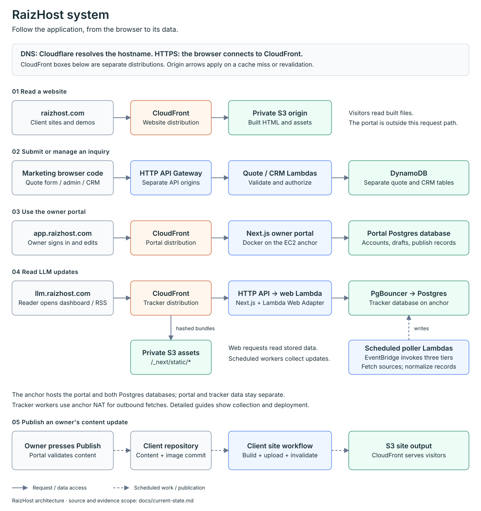

# RaizHost architecture

**How RaizHost websites, the owner portal, and LLM Tracker fit together.**

RaizHost builds and hosts websites for local businesses. Its public website brings in
inquiries; its owner portal lets clients update their websites; LLM Tracker collects and
explains releases across AI providers. They share parts of an AWS platform, with different
serving, storage, and publishing paths.

This guide focuses on those RaizHost applications and the services that support them.
Start with the map, then follow an application from a user action to its stored data.

| Application | What someone uses it for | How it runs | Walkthrough |
| :-- | :-- | :-- | :-- |
| [raizhost.com](https://raizhost.com) | Explore services, read the blog, request a quote | Astro output in S3, served by CloudFront; separate quote and CRM APIs | [Website and inquiries](docs/raizhost-com.md) |
| [app.raizhost.com](https://app.raizhost.com) | Save content edits, preview a client site, publish updates, request managed work | Next.js container on the shared EC2 anchor, backed by Postgres | [Owner portal and publishing](docs/app-raizhost-com.md) |
| [llm.raizhost.com](https://llm.raizhost.com) | Follow provider releases, models, status, CLI references, and RSS feeds | Next.js web Lambda reads Postgres; separate scheduled Lambdas collect data | [LLM Tracker](docs/llm-raizhost-com.md) |
| Client sites and [demos](https://demos.raizhost.com) | Visit a business website or review an example | Static files in S3 behind CloudFront | [Client delivery](docs/client-provisioning.md) |

> **Cloud controls updated 2026-10-09.** Audit logging, encrypted storage defaults,
> verified backups, independent backup alarms and table-deletion protection are live. September gross usage
> was **$127.32**; the live gross budget is **$250/month across all AWS workloads**.
> The serving topology remains single-AZ; automatic failover is a future milestone.
> [Cloud operations](docs/cloud-operations.md) separates the operating baseline from the
> target design. [Current evidence](docs/current-state.md) preserves each audit's scope.

## Start with the action

| What happened? | Follow this path |
| :-- | :-- |
| An owner changed opening hours and pressed Preview or Publish | [Button → draft → Git commit → client build → public result](docs/owner-publishing.md) |
| The client website is building or an update looks stuck | [Client CI/CD stages](docs/client-site-cicd.md), then [status and recovery](docs/publish-status.md) |
| A developer changed the portal, marketing site or tracker | [Application code CI/CD](docs/ci-cd.md) → [deployment identity](docs/authorization.md) → [release verification](docs/release-verification.md) |
| A visitor opens a page or submits an inquiry | [Request routing](docs/request-flow.md) and [website APIs](docs/raizhost-com.md) |
| A provider releases an LLM update | [Scheduled collection → database → dashboard / RSS](docs/llm-raizhost-com.md) |
| A new client needs hosting and owner access | [Provisioning and content-source connection](docs/client-provisioning.md) |
| Infrastructure needs a cost, security or recovery change | [Cloud operations and staged resilience](docs/cloud-operations.md) |

For example, **Publish in the owner portal** saves the latest draft, checks permission and
source revisions, and commits content to the **client site's repository**. That branch push
starts the site's checks and build, followed by S3 uploads, CloudFront invalidation and its
post-deploy checks. The portal polls the matching workflow before reporting its result.
The [walkthrough](docs/owner-publishing.md) shows each handoff, including HTTP 202, preview
versus live branches, and what a green workflow can actually prove.

## The system at a glance

  

Read each lane from left to right. Solid arrows show requests or data access; dashed arrows
show scheduled work or publication. CloudFront boxes represent separate distributions.
Cloudflare supplies DNS answers; the browser's HTTPS connection goes to CloudFront.
[Open the full-size diagram](diagrams/architecture.svg) to inspect its labels.

1. **Visit a website.** CloudFront serves cached HTML and assets, fetching from the site's
   private S3 origin when needed. A published client site can keep serving while the owner
   portal is unavailable.
2. **Submit an inquiry.** Browser code on raizhost.com calls a separate HTTP API Gateway.
   Its Lambda validates and stores the submission in DynamoDB, then attempts email through
   Resend. The saved inquiry and the email outcome are separate records of success.
3. **Edit a client site.** CloudFront forwards authenticated portal requests to the Next.js
   container on the anchor. Save writes a Postgres draft. Built Preview and Publish commit
   content to different client branches. The client workflow builds and deploys to the
   selected destination; the portal reconciles the exact content commit's workflow result.
   [Trace the owner-to-live path](docs/owner-publishing.md).
4. **Read LLM updates.** CloudFront sends uncached dashboard requests through API Gateway
   to the web Lambda. It reads collected data through PgBouncer into Postgres. Hashed
   browser bundles take a separate S3 path.
5. **Collect LLM updates.** EventBridge invokes three poller tiers. They fetch upstream
   sources, normalize results, and store data plus run outcomes. Visiting the dashboard
   does not start this scheduled collection.

## Where state belongs

| State | Home | Why the distinction matters |
| :-- | :-- | :-- |
| Published website files | S3, cached by CloudFront | Visitors read built output; they do not query portal drafts |
| Client website design, content contract, and committed revisions | Each client's Git repository | The app changes allowed content; a committed source revision still needs deployment |
| Accounts, tenant membership, active drafts, and publish tracking | Portal's Postgres database | Saving and tracking an update are separate from deploying it |
| Provider events, model/reference records, and poller outcomes | Tracker's Postgres database | Dashboard requests read collected data rather than fetching every provider |
| Quotes and CRM records | Separate DynamoDB tables | Lead capture has no Postgres dependency |
| Curated tracker tips and guides | Markdown in the tracker repository | Editorial content ships with application code |

The **anchor** is the shared EC2 host for the portal and relational services. PgBouncer
limits connection pressure from short-lived tracker Lambdas. The documented network also
uses the anchor for outbound access from private Lambda subnets. This saves dedicated
infrastructure but couples failure domains: an anchor outage can affect editing, tracker
database reads, and scheduled collection. Static website delivery follows its own S3 path.

## Follow a path

| Guide | Question it answers |
| :-- | :-- |
| [Request flow](docs/request-flow.md) | Which origin handles a URL, and where does caching happen? |
| [Owner portal](docs/app-raizhost-com.md) | Where does the editor run, and how is it connected to a client site? |
| [Owner-to-live walkthrough](docs/owner-publishing.md) | What exactly happens after Preview or Publish, including photos and branch behavior? |
| [Client website CI/CD](docs/client-site-cicd.md) | What tests, build, AWS writes and verification run for an owner's content commit? |
| [Publication status](docs/publish-status.md) | How does the result reach the portal, and what happens if confirmation or deployment fails? |
| [LLM Tracker](docs/llm-raizhost-com.md) | Where does the data come from, and how does it reach a page? |
| [Website and inquiries](docs/raizhost-com.md) | How do the static website, quote form, and CRM work together? |
| [Deployment flow](docs/deploy-flow.md) | Which workflows release each application? |
| [Application code CI/CD](docs/ci-cd.md) | What runs on a PR, which checks block merging, and what selects an application release? |
| [Authorization gates](docs/authorization.md) | Who may release code, obtain AWS permissions, or change a client's content? |
| [Release verification and recovery](docs/release-verification.md) | What proves a rollout succeeded, and what happens after a partial failure? |
| [Client provisioning](docs/client-provisioning.md) | How does a client get hosting and an editable site? |
| [Design decisions](docs/decisions.md) | Why use this mix of static hosting, Lambda, and EC2? |
| [Current state](docs/current-state.md) | Which claims were checked, and what still needs verification? |
| [Cloud operations](docs/cloud-operations.md) | What is the current cost/recovery baseline, and what gates the planned two-AZ platform? |

## Maintaining this guide

Application source and release workflows define behavior. Live reads establish deployed
state. Terraform records intended infrastructure, with known drift documented separately.
A successful build alone does not prove a deployment, a successful publication, or healthy
data collection.

Keep private resource identifiers and credentials out of this repository. Update the
relevant walkthrough, diagram, and dated evidence together when a path changes. Diagram
sources, rendering commands, and validation are described in [the diagram guide](diagrams/README.md).

For infrastructure batches, collect the final live verification first, then make one
consolidated update to this repository. Keep the deployed diagram, cost, trust boundaries,
recovery limits and evidence dates consistent. Prepared code and planned controls must
remain labeled until their deployment and acceptance checks have actually completed.

Architecture documentation is licensed under [CC BY 4.0](LICENSE).
