# How app.raizhost.com works

[System overview](../README.md) · [Request flow](request-flow.md) · [Deployment flow](deploy-flow.md)

The owner portal is the editing and management surface for a client's RaizHost website.
An owner can change the content exposed by that website's contract, save a draft, inspect
a preview, and publish. Design and structural changes go through tracked managed requests.

## The runtime

The browser resolves `app.raizhost.com` through Cloudflare DNS and connects to CloudFront.
CloudFront forwards portal requests to an always-on Next.js container running in Docker on
the EC2 anchor. Postgres stores accounts, tenant membership, drafts, and publication records.
Better Auth handles authentication; server-side checks enforce membership, role, subscription,
and permitted fields. An owner-facing control is only the interface to those checks.

The [portal authorization diagram](authorization.md#portal-content-authorization) shows
the session, tenant, write-role and conditional billing gates, including their rejection
paths. Read access and write access follow different checks.

Authenticated pages and APIs must not share personalized responses through a public cache.
Static bundles have a different caching policy. The historical portal Lambda was retired;
the current release workflow deploys a container through ECR and SSM.

## The website defines the editing boundary

Each connected client repository supplies these files:

| Path | Responsibility |
| :-- | :-- |
| `raizhost/content-map.json` | Controls, labels, types, validation limits, and owner/managed access |
| `raizhost/content.json` | Current published content values |
| `public/uploads/` | Images committed with content updates |

The v2 map makes routine owner controls available across subscribed plans and preserves
managed design values on the server. Legacy v1 maps retain their older access rules until
deliberately migrated. The site consumes the content during its own build. Preview markers
such as `data-rh` let the editor's working preview update the corresponding visible elements.

## Save, preview, and publish

  

| Action | What it writes | What the visitor sees |
| :-- | :-- | :-- |
| Edit the working preview | Temporary browser state | The public website is unchanged |
| Save | Active draft and a monotonic revision in Postgres | The public website is unchanged |
| Build a preview | Content commit on the configured preview branch; workflow output under `/_preview/` | The public root is unchanged; the preview is noindexed |
| Publish | Content and image commit on the configured live branch, then a site workflow run | S3 objects change during deployment; the portal confirms success from the workflow |
| Restore a prior revision | A draft based on earlier content | It must go through publication to become public again |

The inline working preview is immediate browser feedback. A built preview exercises the
real site's build and deployment. A noindexed preview is excluded from search indexing;
that label does not itself provide authentication or private access.

The GitHub source adapter commits through GitHub's API. It supports GitHub App installation
credentials and an interim token path; this guide does not claim that the production
credential migration has finished. The portal does not run the connected site's Astro build.

## Example: changing opening hours

1. The owner opens the editor. The portal reads the map and values at an immutable repository
   revision, together with any saved draft.
2. The owner changes the hours. The server validates the queued save and accepts it only if
   the expected draft revision still matches.
3. Preview commits the selected draft to the preview branch. The site workflow builds the
   preview below its isolated prefix.
4. Publish saves the latest intended values and commits allowed content and images to the
   live branch, checking that the source has not changed underneath the edit.
5. The client repository's workflow builds the site, uploads to S3, and invalidates CloudFront.
   The portal associates the run with the content commit and records its confirmed result.

## Concurrency and failure boundaries

Draft saves use compare-and-swap revisions: a stale tab cannot silently replace newer work.
The revision survives draft deletion, so a delayed autosave cannot recreate a discarded or
published draft. Source changes and draft conflicts have different recovery paths.

GitHub lookups distinguish a matching run, confirmed absence, and an unavailable response.
An API outage leaves publication unconfirmed. A successful content commit alone does not
mean the site is live; only a confirmed successful workflow permits that status.

Live S3 publication is not an atomic swap. A failing workflow may already have uploaded some
objects, so a failure cannot promise that the previous public version is intact. Preview
isolation is enforced by its branch/prefix contract. Git history supports recovery, but
restoring public output still requires a new successful deployment.

The older Puck page-builder renderer has a separate direct-publication implementation. The
flow above describes connected, hand-built client websites. Releasing portal code is also
separate from an owner pressing Publish.

For portal code, follow [CI/CD](ci-cd.md) into the [rollout and rollback gates](release-verification.md#portal-rollout-and-rollback).

**Source basis:** `raizhost-app`'s content contract, `src/lib/content/`, authentication checks,
and anchor deployment workflow at the revision in [current state](current-state.md).
