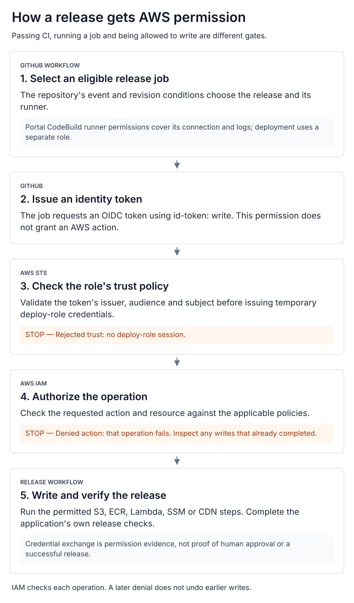

# Authorization gates

[System overview](../README.md) · [CI/CD](ci-cd.md) · [Owner portal](app-raizhost-com.md) · [Release verification](release-verification.md)

There are three different permission questions: whether an operator has approved a
production effect, whether a workflow can perform an AWS operation, and whether an
application user can change a particular website. Each has its own authority.

| Gate | Where it is decided | What it establishes |
| :-- | :-- | :-- |
| Operational authorization | Explicit approval for the production effect under RaizHost's operations procedure | Permission to merge an automatic release, dispatch a deployment, or execute an infrastructure change |
| Repository and workflow checks | GitHub branch settings and workflow conditions | Whether a merge or job meets its configured conditions |
| Deployment identity | GitHub OIDC, AWS STS and IAM | Whether this job can assume a role and perform a specific operation |
| Application access | Server session, tenant/role, billing and content checks | Whether this user may read or change this site's data |

Human approval is not a credential. A successful credential exchange is not evidence that
someone approved a release. Marketing's dispatch includes an explicit production approval
boolean, but its named `production` environment had **no reviewer, wait-timer, or branch
protection rules** configured in the 2026-09-12 API read. The portal and tracker deploy jobs
do not declare a GitHub environment gate. The [CI/CD guide](ci-cd.md) records their actual
branch checks and triggering conditions.

For a routine owner content publication, the user's confirmation and the portal's server
checks authorize the action. Showers' client workflow has no additional staff-approval,
PR-merge or GitHub environment step for each click. Trace its two credential handoffs—
portal to GitHub, then workflow to AWS—in the [owner walkthrough](owner-publishing.md#which-credentials-cross-the-handoff).
Repository branch policy still controls whether the portal's credential may push directly.
The [Showers gate read](current-state.md#owner-publication-evidence) found a main-branch PR
policy with administrators exempt; successful admin writes do not establish installation-wide
bypass permission.

## Deployment identity

  <a href="../diagrams/deployment-identity.svg"><picture>
    <source media="(max-width: 600px)" srcset="../diagrams/deployment-identity-mobile.svg">
    
  </picture></a>

1. The job must satisfy its repository's [event and revision conditions](ci-cd.md#3-select-the-release-and-its-exact-revision).
2. GitHub-hosted runners execute marketing/tracker releases. The portal uses CodeBuild
   runners. Its factory template filters queued jobs by event, trusted actor and workflow
   name, and declares a service role for connection-token access and its own logs.
3. A deployment job with `id-token: write` requests a signed GitHub OIDC token. That GitHub
   permission allows requesting an identity token; it does not grant an AWS action.
4. AWS STS evaluates the token against the role's trust policy. The inspected OIDC module
   constrains the audience to `sts.amazonaws.com` and the subject to a repository plus
   branch or named environment. A rejected exchange gives the job no deploy-role session.
5. Temporary role credentials allow only operations permitted by the applicable IAM
   policies. Each operation can fail independently. For example, an invalidation denial
   after an upload does not restore old S3 objects.

The CodeBuild runner's service role and the workflow's deploy role are separate. The anchor
also uses its own runtime AWS identity for tasks such as fetching the app environment and
pulling its image. Portal sessions and client-site GitHub credentials follow other paths.

The CodeConnections GitHub App installation is a repository-access trust boundary. Separate
CodeBuild projects do not by themselves separate repositories selected into one installation.
The factory's onboarding procedure controls that scope.

This diagram describes the inspected workflow and infrastructure declarations. Live AWS
trust policies, resource grants and installation scope were not re-audited here; the
[evidence record](current-state.md) keeps that limitation distinct from the fresh GitHub
settings read. [Open the identity diagram](../diagrams/deployment-identity.svg).

## Portal content authorization

This flow covers connected-site **Save, Preview and Publish** requests. The API handlers
enforce it even when a caller bypasses the editor interface.

  <a href="../diagrams/portal-authorization.svg"><picture>
    <source media="(max-width: 600px)" srcset="../diagrams/portal-authorization-mobile.svg">
    
  </picture></a>

| Check | Server behavior |
| :-- | :-- |
| Session | `requireAuthApi` validates the Better Auth session; absent/invalid sessions return 401 |
| Website access | `withTenant` joins tenant membership for non-admins; absent membership, tenant, or content source returns 404 |
| Write role | A tenant viewer cannot write (403); editor and owner memberships can. Platform admins can access tenants across the platform |
| Billing | When billing is enabled, non-admin writes require `canEdit`; a lock returns 402. Admins bypass this check; disabling billing skips it |
| Content contract | Server validation controls owner-editable versus managed values, field shape and limits; legacy maps retain their older access rules |
| Revisions and target | Draft revision and source head bind the operation to the version reviewed by the user. Preview/live must be explicit; a missing target never defaults to live |

Billing is an editing gate, not proof of payment: the inspected implementation also permits
complimentary and legacy unconfigured states. A blocked write does not remove the member's
read access. Reads still require a session, accessible tenant and connected content source,
but skip the write-role and billing gates.

The website map's `owner` field-access label means client-editable content; it is different
from the tenant membership role named `owner`. An authorized tenant editor can change those
fields too. Managed values are preserved by server validation.

Action validation is not identical for every operation. Save rejects forbidden field changes
but can retain an incomplete draft with validation problems. Preview/live publication requires
a valid draft (422 otherwise). Stale revisions or moved source heads return conflicts (409);
malformed requests and unavailable previews have their own errors. Rate limits can return
429 before a publish creates a commit. Authorization alone never guarantees a write succeeded.

Save stores a Postgres draft. Preview/live publication creates a GitHub commit using the
server's configured source credential; the client repository's workflow deploys the output.
Only its matching successful run confirms publication. A committed update can remain
unconfirmed during a GitHub outage. [Open the portal gate diagram](../diagrams/portal-authorization.svg)
and follow the [publication lifecycle](owner-publishing.md#follow-the-handoff) and
[status guarantees](publish-status.md).

## Other application boundaries

| Surface | Actual boundary |
| :-- | :-- |
| Public website, client sites, tracker pages and RSS | Public reads; no portal account required |
| Public quote submission | Payload validation and anti-abuse checks; no admin token required |
| Quote administration and sales CRM | Separate bearer credentials, checked against stored token hashes in their respective APIs; the CRM also separates its mirror-write credential |
| Tracker manual poll route | Admin token plus a forwarded-address check. That header check is not proof of network isolation: the source accepts a missing forwarded header |
| Client preview | Branch/prefix separation and noindex control publication/indexing; neither supplies private access |
| Infrastructure apply | Static CI cannot apply. Live reconciliation, review of concrete changes and effect authorization precede execution under the owning runbook |

CORS, a hidden button, an API URL and a noindex tag do not authenticate a caller.
The normal tracker collection path is [EventBridge invoking tier Lambdas](llm-raizhost-com.md),
not the manual HTTP route. This guide documents gates without invoking any write endpoint.

**Source basis:** portal `src/lib/api-utils.ts`, content routes' `_shared.ts`, content service
and billing state; marketing function handlers; tracker manual poll route; deployment
workflows; infrastructure OIDC module and runner template at the [recorded revisions](current-state.md).
