# Client provisioning

Going live for a new client used to be ~12 console steps. It is now one command that plans by
default and mutates only on `--execute`, which trips the operations guard's approval prompt.

```text
node infra/new-client-site.mjs --slug <slug> --domain <domain> [--no-www] [--no-dns] [--execute]
```

<p align="center">
  
</p>

<sub>Editable source: [`diagrams/client-provisioning.mmd`](../diagrams/client-provisioning.mmd). A committed SVG is embedded so the flow remains visible in GitHub's mobile clients.</sub>

## Properties that matter

- **Idempotent.** Live AWS is the state; every step is check-then-create and safe to re-run.
  Existing resources are reported, not touched.
- **Re-entrant across the certificate wait.** The same command twice is the normal path.
- **DNS is create-only.** An existing record with different content is reported and left
  alone — so an MX record can never be clobbered by a site launch.
- **Drift alarm.** The checked-in CloudFront Function source is byte-compared against the live
  reference function on every run; divergence aborts before anything is created.
- **Registry out, not just resources.** Each client gets a JSON registry of every ID plus a
  `terraformImport` map, so adoption into Terraform is a mechanical import loop later.
- **Monitoring is part of go-live**, not a follow-up: health check + alarm are created in the
  same run. (The first alarm evaluation fires one ALARM→OK pair before real data arrives — that
  pair is the delivery test.)

## After launch: content updates

There are now two deployment lanes:

- **Owner self-service:** `app.raizhost.com` writes allowed content and uploaded assets to the
  client's source repository. The site's own GitHub Actions workflow builds, performs the four-pass
  cache-control sync, and invalidates CloudFront. Git history is the restore path.
- **RaizHost-managed changes:** structural/design work and older ops-repo sites still use the gated
  command below. This path has a two-pass asset/HTML cache split and a deletion guard.

```text
node infra/site-update.mjs <slug> [--execute] [--allow-delete]
```

Runs the site's own link/rendering checks, bumps a site-wide `?v=N` cache-bust, does the
two-pass `s3 sync` with the proven cache-control split, invalidates `/*`, polls until complete,
then verifies live 200s and headers. Deleted files are listed and the run aborts unless
`--allow-delete` — the guard against syncing the wrong directory into a production bucket.
