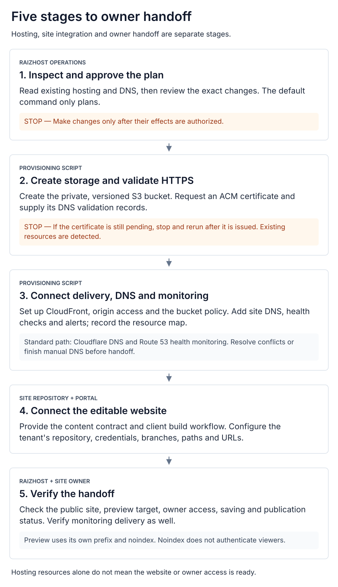

# Bring a client website online

[System overview](../README.md) · [Owner portal](app-raizhost-com.md) · [Owner publishing](owner-publishing.md) · [Operator reference](#operator-reference)

A client needs **hosting, a working website, and an owner connection**. The provisioning
script creates the hosting destination. The site's repository supplies the pages and
deployment workflow. The portal gives the owner access to edit and publish that site's content.

## From plan to handoff

The hosting script covers stages 1–3. Site integration and owner handoff follow in stages
4–5. Pause at any unmet prerequisite before continuing.

<p align="center">
  <a href="../diagrams/client-provisioning.svg"><picture>
    <source media="(max-width: 600px)" srcset="../diagrams/client-provisioning-mobile.svg">
    
  </picture></a>
</p>

### 1. Review the plan — RaizHost operations

Inspect the domain and any existing resources. The provisioning command defaults to a
read-only plan. Review its proposed changes and obtain authorization for those effects
before executing them. An `--execute` flag is an execution switch, not an approval record.

### 2. Prepare storage and HTTPS — provisioning script

Create a private, versioned S3 bucket and request an ACM certificate. Add the certificate's
DNS validation records so AWS can verify control of the domain.

**Certificate pending? Pause here.** If issuance does not finish during the script's wait,
rerun after the certificate is issued. The script detects resources it has already created.

### 3. Connect delivery and monitoring — provisioning script

Create the CloudFront distribution and its origin access control, then allow that
distribution to read the private bucket. Add site DNS, health checks and alerts, and record
the resource map for later operations and Terraform imports.

The standard automated path uses Cloudflare for DNS. Route 53 health checks monitor
availability. If DNS is skipped or handled manually, complete that work separately;
conflicting existing records are reported for resolution rather than overwritten.

### 4. Connect the editable site — site repository and portal

The site repository needs three pieces:

- `raizhost/content.json`: the content the pages read when building.
- `raizhost/content-map.json`: which fields the owner may edit and which remain managed.
- A build/deploy workflow with AWS permissions scoped to that site's destinations.

Then configure the portal tenant's content source: repository, source credential, live and
preview branches, workflow filename, content/upload paths, and public/preview URLs.

### 5. Verify the handoff — RaizHost and the owner

Check that the public site loads and that the owner can sign in, save, build a preview and
follow a publication to its result. Verify the changed page and monitoring delivery/recovery.
Created resources alone do not establish that the site is ready.

The preview belongs beneath `/_preview/` and carries noindex; the production site is
indexable where appropriate. **Noindex does not restrict access** to the preview.

## What happens after handoff?

An owner change follows the [Preview/Publish walkthrough](owner-publishing.md). The portal
commits content to the client repository, whose workflow builds and deploys the site.
Photo uploads make separate asset commits and can trigger that workflow too. The
[Showers CI/CD guide](client-site-cicd.md) is a verified example.

Managed layout and code changes follow the site's reviewed code/deploy path.

## Operator reference

<details>
<summary>Provisioning command, reruns and optional DNS handling</summary>

Run from the operations repository:

```text
node infra/new-client-site.mjs --slug <slug> --domain <domain> [--no-www] [--no-dns] [--execute]
```

Without `--execute`, this inspects existing state and prints a plan. Review DNS handling
for the selected options and available credentials; skipped or manual DNS work still needs
completion before handoff. The script checks existing resources and the expected CloudFront
routing function before creation. It can be rerun after certificate validation.

Authorization comes from the approved effects. Do not assume an approval hook ran merely
because a command accepted its flags.

</details>

<details>
<summary>Update command for older operations-hosted sites</summary>

```text
node infra/site-update.mjs <slug> [--execute] [--allow-delete]
```

This command owns its build/link checks, asset/HTML cache handling, invalidation and deletion
guard. It is a separate path from the portal's connected-site publisher.

</details>

**Source basis:** operations `infra/new-client-site.mjs`, `infra/site-update.mjs`, the client
launch runbook, and the portal content contract. These describe the inspected implementation;
this guide does not establish a current client count or onboarding status.
