# The client website's CI/CD pipeline

[System overview](../README.md) · [Owner-to-live walkthrough](owner-publishing.md) · [Application code releases](ci-cd.md) · [Status and recovery](publish-status.md)

**The client repository turns an owner's content commit into the files visitors receive.**
This page follows Showers Auto Detail's `Deploy` workflow at the
[recorded revision](current-state.md#owner-publication-evidence). It is a concrete implementation,
not a guarantee that every RaizHost client has the same build or access policy.

## Which event starts it?

The workflow runs on pushes to **`main` and `preview`**, and also supports an operator's
manual dispatch. There is no path filter: content edits, photo uploads and code commits on
those branches can all start it. The owner portal normally supplies a Git branch update,
not a deployment dispatch or pull request.

That assumes GitHub accepts the branch write. A fresh branch-policy read found a PR policy
on main with zero required approvals and administrators exempt; preview was unprotected.
Zero approvals does not remove a PR requirement for identities subject to it. The portal's
source credential must have the necessary write/bypass authority; it does not create a PR
if GitHub rejects the direct update. See the [dated gate evidence](current-state.md#owner-publication-evidence)
and [GitHub's branch-policy explanation](https://docs.github.com/en/repositories/configuring-branches-and-merges-in-your-repository/managing-protected-branches/about-protected-branches).

Concurrency is grouped by branch with `cancel-in-progress: false`; an active deployment is
not deliberately cancelled by the next push through that setting. Inspect the exact run for
queued, cancelled or superseded work. Do not promise that every rapidly queued update will
become the version a visitor sees.

## What must pass before output is written?

  

Read the build column downward, then the deployment column downward. Steps run in one job;
a failing step prevents later normal steps. AWS writes start after the build and credential
exchange. [Open the pipeline](../diagrams/client-site-cicd.svg).

| Stage | What the inspected workflow actually checks or does |
| :-- | :-- |
| Source and toolchain | Check out the run revision; set up Node 22 with lockfile-based npm caching |
| Workflow policy | `npm run test:workflows` checks immutable Action references |
| Dependencies and unit checks | `npm ci`, then `npm run test:unit`; current tests cover safe JSON-LD and service-pricing behavior |
| Target selection | `main` selects live; other refs in the selection script choose preview. Normal push triggers accept only main/preview |
| Build | `npm run build` runs Astro with `PREVIEW=0` or `1`; content is imported into the generated site |
| AWS authorization | OIDC credential exchange into the configured site deploy role; each AWS operation still needs permission |

There is no PR-only test job, staff-approval job, GitHub environment gate, browser acceptance
suite, or separate portal CI dependency in this workflow. Do not insert those boxes into
this path because another RaizHost repository has them. The workflow comments describe a
branch-subject OIDC trust contract; deployed IAM policy was not freshly read.

## Where does each branch deploy?

| Setting | Live push | Preview push |
| :-- | :-- | :-- |
| Git branch | `main` | `preview` |
| Build flag / Astro base | `PREVIEW=0`; `/` | `PREVIEW=1`; `/_preview/` |
| S3 destination | Site bucket root | Same bucket's `_preview/` prefix |
| Invalidation request | `/*` | `/_preview/*` |
| HTTP smoke target | `https://showersautodetail.com/` | `https://showersautodetail.com/_preview/` |
| Page indexing | Normal page-level policy | Layout emits `noindex, nofollow` |

Target selection happens before the build. The site's `sitePath` helper applies the base to
internal links and owner-uploaded assets; its layout points preview canonical URLs at the
production page. A prefix and noindex tag isolate publication/indexing, not viewer access.

## How are S3 and CloudFront updated?

The workflow uses four upload/cleanup passes **inside the selected destination**:

| Order | Output | Cache policy / deletion behavior |
| :-- | :-- | :-- |
| 1 | Hashed `dist/_astro/` assets | One year, immutable; no deletion sweep |
| 2 | Existing `images/`, `fonts/`, `uploads/` directories | 30 days; no deletion sweep |
| 3 | Remaining output, including HTML and metadata | `max-age=0, must-revalidate`; excludes the asset trees already uploaded |
| 4 | HTML-only synchronization with deletion | Only removed `.html` files are eligible; `_preview/*` is excluded, preserving preview HTML during a live-root cleanup |

Assets precede HTML so newly served pages can reference uploaded files. Preview uploads stay
under their prefix. A live invalidation of `/*` can evict preview cache entries too; it does
not overwrite the preview's S3 objects.

The job then requests a CloudFront invalidation and retries an HTTP HEAD request to the
selected root URL up to six times, with ten seconds between failed attempts. A successful
request lets the job finish. It **does not wait for invalidation completion or assert that
the response body contains the edited content**.

Visitors continue using CloudFront and S3. Reading the public site does not call the portal,
its draft database, GitHub, or a build service. The client workflow shown here publishes
the static frontend; it is not evidence that unrelated client backend services were redeployed.

## What does failure leave behind?

| Failure point | Consequence |
| :-- | :-- |
| Checks, build or OIDC exchange | This run has not reached its S3 upload steps |
| Asset/HTML sync or cleanup | Some objects may already have changed; there is no atomic release switch |
| Invalidation request | Uploaded objects remain; caches can still serve earlier responses |
| HTTP smoke | Output may already be uploaded and invalidation requested; failure does not mean nothing was published |
| Portal cannot read the run | GitHub may still be building or may have finished; the portal retains its last confirmed state |

A failed deployment needs inspection of its exact SHA, branch, completed steps and served
output. Rebuilding a reviewed known-good revision is a new deployment, not an automatic
rollback of prior S3 writes. An owner's History restore creates a draft and follows the
normal publish path. [Publication recovery](publish-status.md#where-should-i-look-when-an-update-is-stuck)
distinguishes a status recheck, exact-run retry and a new content publication.

## Source map

| Implementation | Pinned source |
| :-- | :-- |
| Trigger, concurrency, gates, S3 passes and smoke | [deploy.yml](https://github.com/JadenRazo/showersautodetail/blob/74c8dcacb5cd4f783dd44a39c34af126e2a8624c/.github/workflows/deploy.yml) |
| Build and test commands | [package.json](https://github.com/JadenRazo/showersautodetail/blob/74c8dcacb5cd4f783dd44a39c34af126e2a8624c/package.json) |
| Preview base | [astro.config.mjs](https://github.com/JadenRazo/showersautodetail/blob/74c8dcacb5cd4f783dd44a39c34af126e2a8624c/astro.config.mjs) |
| Content import and path handling | [site-content.ts](https://github.com/JadenRazo/showersautodetail/blob/74c8dcacb5cd4f783dd44a39c34af126e2a8624c/src/lib/site-content.ts) |
| Indexing and canonical URL | [Layout.astro](https://github.com/JadenRazo/showersautodetail/blob/74c8dcacb5cd4f783dd44a39c34af126e2a8624c/src/layouts/Layout.astro) |

Source links may require repository access. Successful preview/live runs and anonymous
page observations are recorded separately in [current state](current-state.md#owner-publication-evidence).
