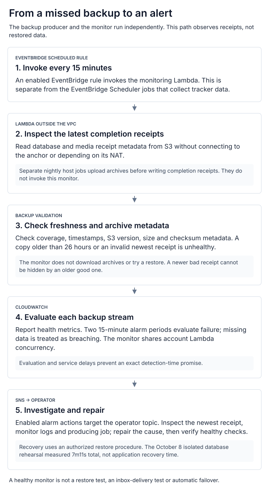

# Cloud operations and staged resilience

[System overview](../README.md) · [Dated evidence](current-state.md) · [Decisions](decisions.md)

**Evidence: October 11 origin/topology/alarms; October 8 foundations/recovery; October 11 budget.** The live gross budget is **$250/month across
production, operations and learning workloads**. The design target reserves $25
and allocates up to $225 to planned usage. The controls below have been deployed
and checked; the two-AZ application/database migration remains conditional on the readiness gates.

## What runs today

Static sites retain the CloudFront/private-S3 serving path shown in the overview.
Dynamic workloads use API Gateway/Lambda where suitable. The owner portal runs
on a shared EC2 anchor with PostgreSQL, PgBouncer and Redis; private Lambda egress
also depends on that host. The portal now reaches it through an HTTPS ALB with a
private HTTP target hop. [Portal ingress](portal-ingress.md) and
[failure domains](failure-domains.md) make these boundaries explicit. An anchor failure can affect editing,
database consumers and external collection together.

The anchor is a Graviton `t4g.medium`; the operations host is `t4g.large` with a
120 GiB root volume. Both are in one Availability Zone. The operations host still
runs production workloads, so it cannot be scheduled off as a cost optimization
until those dependencies have been moved and verified. Current EC2 topology does
not provide automatic application or database failover across AZs.

## Measured cost and the budget gate

| Measurement | USD | Meaning |
| :-- | --: | :-- |
| September gross AWS usage | 127.32 | Excludes credits and refunds; read through Cost Explorer |
| October gross forecast | 130.94 | Budget read October 11; updated October 10 at 22:28 UTC; not a commitment |
| October 1–10 gross usage | 39.59 | Estimated and subject to billing lag; excludes credits/refunds |
| Program ceiling | 250.00 | Total AWS spend including temporary migration overlap |
| Planned usage target | 225.00 | Conditional on sizing and removing replaced costs |
| Reserve | 25.00 | Buffer inside the ceiling, not an extra allowance |

The gross budget now excludes credits/refunds and alerts above **$200, $225 and
$250 actual**, plus **$225 forecast**. Existing recipients were preserved. A
separate older credit-adjusted budget remains $100 and is not the program's gross
spend gate. Budget notifications are delayed signals, not spending caps. Recheck
usage after billing catches up with the new controls and this batch's CI runs.

The first foundation increment uses a $2/month planning allowance for audit S3
storage and requests, reviewed against actual growth. It uses the first-copy
management-event trail pricing model and the free external-access analyzer type.
Revisit costs if scope, event selection or retention changes. Sources:
[CloudTrail pricing](https://aws.amazon.com/cloudtrail/pricing/) and
[Access Analyzer pricing](https://aws.amazon.com/iam/access-analyzer/pricing/).

Independent backup monitoring adds a **$3/month planning allowance** for four
custom metric series, two standard alarms, Lambda, requests and bounded logs.
This is an allowance, not measured monthly spend or a service cap. The HTTPS ALB
is now deployed, verified October 11. Its source runbook allows about $30/month for
ALB hours, two public addresses and one average LCU; this is a planning estimate,
not a measured full-month ALB bill. The latest forecast above includes only the
usage AWS has processed; it does not establish the full-month effect of the rollout.
RDS and ECS remain conditional targets.

## Deployed controls

| Control | Live verification | Boundary |
| :-- | :-- | :-- |
| Multi-region account CloudTrail | Management reads/writes and global events enabled; real S3 delivery observed; 2/2 digests and 26/26 log files validated for the completed first-hour window | Account trail; no organization trail, paid data events or immutable retention |
| Audit storage | Private, owner-enforced, encrypted and versioned S3; TLS-only client access; 365-day current/noncurrent retention | An administrator can still change AWS controls |
| Terraform state transport | Existing private/versioned state bucket now denies insecure client transport | Legacy root drift remains unresolved; it is not safe to apply |
| EBS encryption default | Enabled and read back in the primary region | Applies to newly created regional volumes |
| External-access analyzer | Free account analyzer ACTIVE; 12 initial non-public IAM trust findings inspected against actual role policies | Findings remain active for intended-access and recovery review; no broad archive rules |
| CRM and quote deletion protection | Both tables ACTIVE and protected; existing 35-day PITR retained | Does not prevent authorized item deletion or prove restoration |
| Backup completion | New scripts require valid source coverage, successful archive upload and a final checksum receipt; unique keys separate concurrent runs | Media and logical database copies are not a coordinated application snapshot |
| Independent backup monitoring | Scheduled Lambda checked both streams healthy; real scheduled execution verified; both missing-data alarms OK with actions enabled on the existing operator topic | Receipt/metadata checks do not prove restored data or notification delivery |

The isolated foundation stack applied eleven resource/setting additions, with no
replacements or deletions, and then produced a no-change Terraform plan. These
controls use a separate state boundary. The table bootstrap sources now preserve
deletion protection for both new and existing tables.

The October 8 audit validation window was **18:24:33–19:24:33 UTC**. This is verification of
delivered files for that completed interval, not a claim about all future logs.

## Independent backup monitoring

  <a href="../diagrams/backup-monitoring.svg"><picture>
    <source media="(max-width: 600px)" srcset="../diagrams/backup-monitoring-mobile.svg">
    
  </picture></a>

An EventBridge **scheduled rule** invokes a small ARM Lambda every **15 minutes**, outside the VPC and
independent of the anchor and its NAT function. It reads the newest completion
receipt for each database/media stream and checks schema, coverage, timestamps,
S3 versions, size and checksum metadata. A completed copy older than **26 hours**,
an invalid receipt or a failed check emits unhealthy status; it never falls back
to an older valid receipt to hide a newer broken one. It does not connect to the
database, download archives, or write backup objects. Its IAM read grant is
limited to the two backup prefixes and also permits archive reads.

CloudWatch evaluates both health streams and treats missing metrics as breaching,
covering a stopped scheduler or monitor as well as stale backups. AWS evaluation
windows and service delays mean this is not an exact 30-minute detection promise.
Logs retain 14 days. The account has ten unreserved concurrent Lambda executions;
the monitor shares that pool and has no dedicated concurrency guarantee.

Acceptance on October 9 verified the deployed code hash, actual healthy results,
two scheduled invocations, both production alarms OK with notifications enabled,
and a no-change plan in the dedicated Terraform state. A separate actionless
alarm demonstrated missing-data failure, healthy recovery, explicit failure,
recovery and missing-data failure again, then was deleted. Production backup
data and thresholds were preserved. No synthetic emails were sent, no inbox
delivery was claimed, and this exercise did not repeat the October 8 restore.

Source and procedure are in [infrastructure PR 10](https://github.com/JadenRazo/aws-infra/pull/10)
and its [quota correction](https://github.com/JadenRazo/aws-infra/pull/11).
These links may require private-repository access. Investigate the alarm's
stream, newest receipt, monitor logs and nightly job before changing thresholds;
re-establish a valid backup and healthy independent checks after repairing the cause.

## Recovery evidence and limits

Nightly logical dumps imply roughly a 24-hour data-loss window when every run
succeeds; missed or unusable backups make that worse. The first new-format run
completed in 3 minutes 40 seconds. Its roughly 1.11 GB compressed database archive
and the media archive were downloaded by exact S3 version and verified against
their receipts, SHA-256, lengths and compressed contents.

An isolated rehearsal then restored **all 10 connectable databases** into a
disposable PostgreSQL 17.11 server. Database loading took **6m04s**; download,
initialization, validation and cleanup took **7m11s total**. Database coverage and
extension versions matched the source inventory; restored tables were counted,
indexes were valid, and the editor database passed `pg_amcheck`. Row counts describe
the restored target; no source row-count baseline was captured for equivalence.

The rehearsal had no network, production connection or application consumers.
Its container and volume were removed, and host capacity was checked afterward.
The measured duration is for this logical restore under its resource limits; it
is **not an application recovery-time commitment or an AZ failover result**.

The small upload archives were traced against the running app. Its active upload
directory matches the mounted backup volume and currently contains zero files;
no ephemeral fallback directory exists. Empty archives alone were not evidence
of data loss. The deployed script verifies coverage, contents, counts and checksums
before reporting backup completion; the first new archive passed an independent
download and content check with zero files and zero source bytes.

PostgreSQL is version 17.10. About 6.39 GiB is in connectable databases and 6.11 GiB
is deliberately retained but disabled. Logical dumps skip databases that disallow
connections. Keep that data retained and prove a separate snapshot or approved
archive recovery before retiring its storage. Version availability, disk size
and an existing snapshot do not prove RDS compatibility or restoration.

## Milestones and remaining work

| Milestone | Work | Evidence required for completion |
| :-- | :-- | :-- |
| Week 1 | Foundation controls, verified archives, measured logical restore and independent backup monitoring are complete | Continue checking delivery, freshness and coverage; preserve the stated recovery scope |
| Weeks 2–3 | Workload-specific permissions, release identity, origin HTTPS and recovery procedures | Allowed/denied access tests, verified TLS origin, recoverable deployments and a timed restore |
| Weeks 4–5 | Shared media, distributed limits, trusted client IP and retry-safe job ownership | Two-instance consistency, tenant isolation, forged-header and duplicate-job regressions |
| Weeks 5–10 | Conditional RDS Multi-AZ, two-AZ ECS and load balancing; resolve shared-host dependencies | Compatible trial restore, single-writer cutover, measured recovery and a cost fit |
| Weeks 10–12 | SLOs, cost reviews, restore/incident drills and operating evidence | Measured outcomes, actual cost trends, owned follow-ups and reconciled architecture |

These are milestones, not a reason to delay preparation or deploy out of order.
Later-phase designs, recovery procedures and acceptance gates are prepared now.
The legacy root reconciliation remains separate from the applied foundation stack.

The October 11 configuration read supersedes the earlier TLS hold: the managed
HTTPS ALB origin is active, one target is healthy and the old direct
CloudFront-to-anchor port rule is absent. The viewer function is associated with
all four portal behaviors. Current portal health matches the inspected application
revision. These reads do not rerun the original forged-header or host-environment
acceptance tests; see [portal ingress](portal-ingress.md).

The operations-role reduction is **incomplete**: the scoped observation policy
is installed, but AdministratorAccess and the SSM policy remain attached. Do not
claim least privilege or assume that merging the source detached the old grant.
Future changes still require independent review, effect authorization and runtime
acceptance. [Diagram evidence](diagram-evidence.md) records the checks and limits.

Backup regressions cover failed dumps/uploads, missing completion receipts,
unknown media coverage, unsupported links, container replacement and overlapping
runs. Independent review found a same-second archive collision; unique run keys
and a concurrency regression closed it before installation. Rollback copies retain
the prior scripts, whose known failure-handling limits must be considered before
using them. The owner-portal dependency patch and pinned ECR Public build image
are deployed at `9f614b8549d76d9163dc95fc953c52001079278d`. Build, authenticated
end-to-end checks, ARM image publication and deployment passed. Public and host
health returned that exact revision with the database up. Production reports
Node 22.23.3, Next 15.5.27 and Sharp 0.35.5; benign JPEG/WebP/AVIF decode and resize
checks passed. Backup hashes and the active timer were preserved. Other dependency
advisories and the broader IAM/network work remain separate security follow-ups.

## Conditional target design

Retain the static/serverless paths. Move the critical owner-app path to two ARM
Fargate tasks across two AZs, behind an HTTPS load balancer, with private RDS
PostgreSQL Multi-AZ primary/standby and shared media. Separate operations from
production and establish independent log/backup ownership.

Shared-state and retry tests come first. Database extensions, working set, IOPS
and connections must fit the chosen RDS class; every anchor/NAT/job dependency
needs a replacement; temporary coexistence must fit the same $250 ceiling. Do
not count retirement or scheduling savings while a host still serves production.
Auxiliary workload capacity remains an open sizing decision. If these gates fail,
retain and harden the existing platform.

Database failover is only part of app recovery. Measure reconnects, connection
pools, retries and correctness. A cutover has one writer; after the new database
accepts writes, reverting to the old one requires data reconciliation. Regional
recovery and immutable retention are separate capabilities, not implied by Multi-AZ.

## Operating evidence

The 15-minute backup monitor is an installed schedule. Additional proposed cadence:
daily external health and backup coverage review; weekly gross spend,
access findings and capacity; monthly isolated restoration and dependency review;
quarterly scoped AZ/regional exercises. Those additional processes are not new schedules.

Each exercise records scope, impact, detection, last recoverable write, elapsed
recovery, correctness, cost and follow-up ownership. Career evidence should show
the actual decision, implementation contribution and measured outcome across
architecture, DevOps, SRE, security and cost management. A plan or passing build
alone does not establish a resilience or cost-saving claim.

After each complete batch is deployed and verified, update the diagram, operating
facts, costs and evidence here together in one consolidated change. Keep future
targets distinct from what actually runs.
