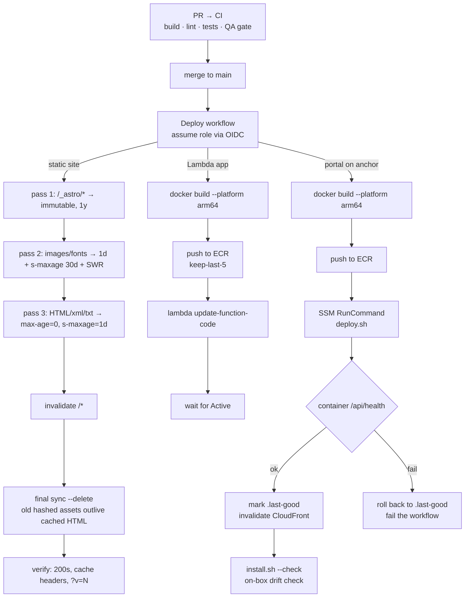

# Deploy flow

Every repository deploys from GitHub Actions using **OIDC role assumption** — a per-repo IAM
role whose trust policy binds to `repo:<owner>/<repo>` *and* the `production` environment on
`main`. There are no stored AWS keys anywhere in CI.

## Why three shapes

| Target | Mechanism | Why |
|:--|:--|:--|
| **Static sites** | `aws s3 sync` in ordered passes + one invalidation | The order matters: HTML goes last so it never references an asset that isn't uploaded yet, and a final `--delete` pass runs *after* invalidation so cached HTML can still find the old hashed assets it points to. `--size-only` is banned because sync only stamps cache-control on objects it uploads. |
| **Lambda apps** | Image push + `update-function-code` | Immutable images, instant rollback by pointing at the previous tag. Images are built arm64 in CI so Graviton Lambdas never run under emulation. |
| **Portal** | SSM RunCommand executing an on-box `deploy.sh` | The portal is stateful and lives on the anchor. SSM gives an audited, IAM-scoped way to run the deploy without opening SSH. The script is health-gated with automatic rollback, and the on-box files are tracked in the app repo with a read-only drift check that runs after every deploy. |

## Terraform

Infrastructure changes go through a `terraform-ci` workflow (fmt, tflint, trivy, plan) plus a
scheduled drift-detection run. Applies for the platform are deliberately targeted and
human-run; day-to-day client provisioning uses the gated scripts described in
[client-provisioning.md](client-provisioning.md), which emit a `terraformImport` map so the
resources they create can be adopted into state later.

## One gotcha worth writing down

After a push, match workflow runs to the exact `head_sha` before trusting them. During a GitHub
Actions incident, a push created *zero* runs and the previous run's green check was easy to
mistake for the new one. A small verify script now does that match and prints the
`gh workflow run` fallback if the event was dropped.
