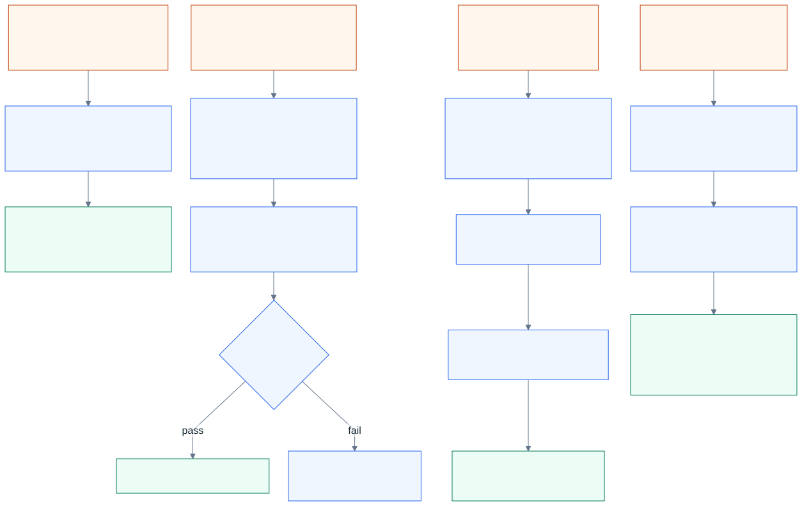

# Deployment flow

[System overview](../README.md) · [Owner publication](app-raizhost-com.md) · [Current evidence](current-state.md)

Each repository owns its release workflow. GitHub Actions uses OpenID Connect (OIDC) to
assume a scoped AWS role. Runner permissions and deployment permissions are distinct:
obtaining a runner does not itself grant permission to change production.

  

## The release paths are repository-specific

| Target | Trigger in the inspected source | Artifacts and destination | Verification |
| :-- | :-- | :-- | :-- |
| `raizhost.com` | Manual dispatch with exact `commit_sha` and `approve_production` | Astro `dist/` → S3 → CloudFront invalidation | Revision binding and website checks in workflow; inspect live output after release |
| `app.raizhost.com` | Successful same-repository **push CI on main** | CI-built ARM64 image → ECR → anchor via SSM | Additive migrations, health gate, rollback on rejected rollout, ops-file drift check |
| `llm.raizhost.com` | Successful CI on main, or manual deployment dispatch | Web image → ECR/Lambda; static bundles → S3; shared ZIP → all three poller Lambdas | Lambda update results, tier invocations, CDN invalidation, live data and feed smoke checks |
| Connected client website | Commit to its configured live or preview branch | Site build → appropriate S3 root/prefix → invalidation | The exact site workflow's checks; portal tracks the content commit's run |
| Quote and CRM APIs | Separate function deployment commands | Function ZIP/configuration → respective Lambda | Function-specific checks; not included in the static website deploy |

This table describes triggers, not blanket permission to run them. An app main merge can
release production automatically; a marketing main merge is not its production deploy.

## Portal code release versus client content publication

The portal's CodeBuild-hosted GitHub Actions jobs use disposable environments. Its image
build and deploy steps separately assume AWS roles. The deploy workflow selects the CI
run's exact SHA, installs the reviewed deploy script through SSM, applies the allowlisted
additive migrations, and restarts the container.

A portal health check must verify the HTTP result, `db: up`, and the expected application
SHA. A generic `ok: true` cannot prove the intended release. Image rollback does not undo
additive database migrations.

An owner pressing Publish follows another path: the portal creates a content commit in
the **client's repository**. That repository builds the public site. It does not redeploy
the portal, and the portal does not compile the connected site's pages.

## Tracker web and collection code ship together

The tracker uses a GitHub-hosted ARM runner in the inspected workflow. It uploads hashed
static bundles before changing the web Lambda so newly served HTML can find its assets.
It then updates all three pollers from the selected revision and checks scheduler-shaped
invocations. This keeps a parser fix from shipping only to the dashboard while scheduled
workers retain old code.

These steps are not atomic across services. A failed deploy requires inspecting which
artifacts changed. A previous green run is not evidence for the requested SHA.

## Static publication and cache propagation

Assets upload before HTML. Cache-control differs by asset class, and each repository owns
its cleanup policy. Marketing requests invalidation before its final cleanup; it does not
wait for invalidation completion there. The tracker retains older hashed bundles and waits
for invalidation before its final smoke checks. Do not copy one workflow's guarantees to
another.

A live S3 sync can partially change public objects before failure. Restoring a known Git
revision or image identifies a recovery artifact; rollout and verification still have to
complete.

## Infrastructure changes

Terraform describes the original platform; CloudFormation owns the ephemeral runner factory;
operations scripts provision client resources and emit import maps. The inspected
infrastructure workflow keeps live Terraform plan/apply disabled while drift reconciliation
is open. Its normal checks run without AWS identity.

Reconcile intended state against a current, reviewed live read before enabling mutation.
Neither a diagram edit nor a passing documentation check authorizes an infrastructure apply.
