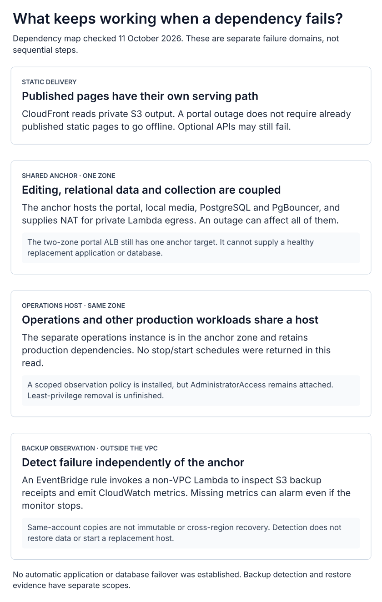

# Shared dependencies and recovery limits

[System overview](../README.md) · [Portal ingress](portal-ingress.md) · [Cloud operations](cloud-operations.md) · [Evidence](diagram-evidence.md)

Static delivery, owner editing, collection and backup observation have different
dependencies. The most consequential coupling is the anchor: it supplies the
portal, relational services, local media and private-subnet outbound routing.

  <a href="../diagrams/failure-domains.svg"><picture>
    <source media="(max-width: 600px)" srcset="../diagrams/failure-domains-mobile.svg">
    
  </picture></a>

| Dependency lost | What can be affected | What follows a separate path |
| :-- | :-- | :-- |
| Portal container | Owner sign-in, editing and management | Already published static pages; tracker has its own web Lambda |
| Anchor host or its zone | Portal, local media, shared database consumers and private Lambda egress | S3/CloudFront static delivery and non-VPC backup observation; cached pages can mask application failures |
| Operations host | Operator tools and other production workloads it hosts | The portal's normal serving process is on the anchor, not the operations host |
| GitHub | Source reads, content commits, new releases and publication confirmation | Files already uploaded to S3 |
| Backup producer | New recovery copies stop or become invalid | Independent monitor can report stale/invalid receipts |
| Backup monitor or its shared concurrency | Health metrics may stop | CloudWatch treats missing data as breaching; detection still depends on AWS evaluation and notification services |

Both EC2 hosts were running in the same zone on October 11. The ALB occupies two
zones but had only one anchor target. Neither a load balancer, separate databases
on one host, nor a healthy status endpoint establishes application or database
failover. No operations-host stop/start entry was returned by the Scheduler read;
do not assume that scheduling savings are in effect.

The operations role has a scoped observation policy **and still has
AdministratorAccess**. A prepared replacement policy is not a completed reduction
of permissions. Source and live role attachments are recorded separately.

The October 8 isolated database restore remains the demonstrated recovery scope.
It did not reconnect a production application, recover the disabled retained
database, exercise regional recovery or supply immutable copies. The
[cloud operations guide](cloud-operations.md#recovery-evidence-and-limits) records
the measured duration, archive coverage and remaining acceptance work.

This page covers dependencies of the RaizHost applications in the overview; it is
not a complete inventory of every product on the account or operations host.
