# How llm.raizhost.com works

[System overview](../README.md) · [Request flow](request-flow.md) · [Deployment flow](deploy-flow.md)

LLM Tracker is a public dashboard for Claude, OpenAI, and Gemini releases, model catalogs,
service status, CLI references, and curated guides. Readers browse collected information
or subscribe to RSS. The application is a tracking service; it does not host model inference.

Its two main jobs run independently: **scheduled workers collect data; the web application
renders that data for readers.** The [source repository](https://github.com/JadenRazo/llm-tracker)
is public.

## From upstream source to dashboard

  

### 1. The registry chooses the work

Each source descriptor declares a stable key, provider, scheduling tier, and parser. The
shared registry drives dispatch, source health, and displayed cadence. Source keys also
participate in persistence and deduplication.

| Tier | Configured interval | Examples in the inspected registry |
| :-- | :-- | :-- |
| T1 | 10 minutes | CLI package versions, Anthropic status, OpenAI status |
| T2 | 30 minutes | GitHub releases, CLI references, Anthropic model catalog, Gemini status |
| T3 | 2 hours | OpenAI/Gemini model catalogs, provider news, selected documentation/catalog scrapes |

These are configured intervals, not promises of instantaneous freshness. Source publication
timing, failed polls, and the CDN cache all affect when a change appears.
[Registry and cadence definitions](https://github.com/JadenRazo/llm-tracker/blob/457f1f14544f4de3ebdfa6115a3b8537b37baea2/src/lib/sources/registry.ts)
are the source of this table.

### 2. Separate Lambdas fetch and normalize

EventBridge Scheduler invokes one Lambda per tier. The three functions use a shared Node.js
ZIP bundle with the tier selected by configuration. Sources within a tier run concurrently;
the runner records each outcome rather than allowing one parser error to erase other results.

Workers fetch provider APIs and documentation, npm package metadata, GitHub releases, and
status feeds. Conditional requests reuse ETags and Last-Modified values where supported.
Timeouts, bounded response sizes, and limited retries constrain upstream fetches. Parsed
records preserve provider identity and source links.

The documented VPC path reaches external sources through the anchor's NAT function and
reaches Postgres through PgBouncer. The web Lambda sets `DISABLE_CRON=1`; in-process cron is
for local or long-running fallback hosting, while EventBridge owns production scheduling.

### 3. Postgres stores data and collection outcomes

| Data | Purpose |
| :-- | :-- |
| `events` | Timeline, with source/external-ID deduplication and separate publication/detection timestamps |
| `models` | Provider-tagged model catalog records |
| `cli_reference` | Commands, flags, reference metadata, and documentation links |
| `mcp_servers` | Catalog entries and ranking metadata |
| `poller_runs` | Per-source attempts, outcomes, conditional-fetch metadata, and errors |

The product is LLM Tracker; the database retains its historical `claude_tracker` name.
It is separate from the portal's database even though both use the anchor's Postgres service.
Curated tips and guides live in repository Markdown and ship with the web application.

### 4. The web Lambda renders stored results

The reader connects to CloudFront. Cached responses can be served at the edge. On a miss or
revalidation, dashboard requests pass through HTTP API Gateway to an ARM64 Next.js container
Lambda using Lambda Web Adapter. The app reads Postgres through PgBouncer and renders the page.
Requests for `/_next/static/*` use a separate private S3 asset origin.

Database-backed pages are `force-dynamic`: the build runs without a production database and
must not bake empty query results into the image. The CDN uses explicit route-specific
windows. Source configuration gives timeline pages a 120-second shared-cache window,
status pages 60 seconds, and model catalogs 600 seconds, with additional bounded
stale-while-revalidate windows. In-memory application caches disappear with their container;
they are not the durable source of tracker data.

The combined feed is `/rss.xml`; provider feeds are `/claude/rss.xml`, `/openai/rss.xml`, and
`/gemini/rss.xml`. The Subscribe interface exposes these feeds for a reader application.

## How to tell whether it is working

`/api/health` reports database reachability, the most recent poll time, failing sources, and
sources that have never run. It intentionally returns HTTP 200 even for degraded dependencies,
so monitoring must read the JSON `ok` value and source details. The most recent poll alone
does not prove every source met its individual cadence; inspect source-level outcomes too.

An unavailable database/query and a successful query returning no rows are different states.
The UI preserves that distinction so an outage does not look like an empty new dashboard.
Provider page content and populated RSS entries complement health checks.

## How a source fix reaches production

The deployment workflow builds the web image, uploads its static bundles before activating
the web Lambda, and updates **all three poller ZIP functions from the same revision**. It
invokes each tier using a scheduler-shaped event and checks the results, then invalidates
CloudFront and checks live pages and feeds. A release can fail after updating some artifacts;
this is coordinated deployment, not an atomic multi-function transaction.

The manual poll endpoint is an authenticated write operation, not a health probe. Routine
documentation and status checks must not invoke it.

[CI/CD](ci-cd.md) diagrams the automatic and manual release triggers.
[Authorization](authorization.md) explains deployment identity and the manual route's
access boundary; [release verification](release-verification.md) describes the exact smoke
checks and recovery limits.

**Source basis:** [poller implementation](https://github.com/JadenRazo/llm-tracker/tree/457f1f14544f4de3ebdfa6115a3b8537b37baea2/src/lib/poller),
[cache configuration](https://github.com/JadenRazo/llm-tracker/blob/457f1f14544f4de3ebdfa6115a3b8537b37baea2/next.config.ts),
[deployment workflow](https://github.com/JadenRazo/llm-tracker/blob/457f1f14544f4de3ebdfa6115a3b8537b37baea2/.github/workflows/deploy.yml),
and the dated evidence in [current state](current-state.md).
