# From an owner's edit to a live website

[System overview](../README.md) · [Portal runtime](app-raizhost-com.md) · [Client CI/CD](client-site-cicd.md) · [Publication status](publish-status.md)

**The portal turns an approved edit into a Git commit. The client's workflow builds and
publishes the website.** S3 stores the resulting files and CloudFront serves them to visitors.

- **Preview** builds the saved draft at the preview destination.
- **Publish** makes a fresh live-branch commit and rebuilds the public website.
- **Save** keeps a draft in the portal database. It does not deploy the site.

This guide follows the connected-site editor at `app.raizhost.com`, using Showers Auto
Detail as the verified client example. Another site's branches, destinations and workflow
must be checked against its own connection.

## Follow the handoff

Read downward. The two panels in stage 4 happen independently: the portal acknowledges the
submission while GitHub runs the release. Status checks can begin while the build is running.

  <a href="../diagrams/owner-publishing.svg"><picture>
    <source media="(max-width: 600px)" srcset="../diagrams/owner-publishing-mobile.svg">
    
  </picture></a>

### 1. Confirm and finish saving — owner and portal

The owner reviews the changes and confirms Preview or Publish. The editor finishes saving
the latest draft, including edits still waiting for autosave. A validation or revision
conflict stops submission.

### 2. Check permission and content — portal

The server checks the session, access to this site, an editing role, and billing access when
billing is enabled. It also checks the editable fields, draft revision and repository source
head. These checks keep a stale tab from silently overwriting newer content.

See the [authorization gates](authorization.md#portal-content-authorization) for rejection
codes. Routine owner publication has no extra staff-approval or PR step in the inspected
client workflow. GitHub must still permit the portal credential's branch write.

### 3. Commit to the client repository — portal and GitHub

For Preview, the portal resets or creates the preview branch at the checked live source,
then commits the draft there. For Publish, it makes a fresh commit on the live branch.
Each content commit changes only `raizhost/content.json`.

Advancing the branch triggers the client's push workflow. The portal does not build the
website itself. The [preview/live comparison](#does-publish-promote-the-preview) explains the
two destinations.

### 4. Track the submission and run the release — independent work

The portal records the content commit, publication ID and target with a `queued` status,
then returns **HTTP 202**. That response means the submission was recorded.

Independently, GitHub runs the client's checks, builds the site, obtains AWS permission,
uploads the files to S3, requests CloudFront invalidation and checks the destination URL.
The [client CI/CD guide](client-site-cicd.md) traces those steps.

**GitHub can keep deploying if the portal fails to confirm the submission.** If the editor
reports that it sent the change but could not confirm it, inspect the existing commit and
run before publishing again.

### 5. Check the matching workflow — browser, portal and GitHub

While a publication is pending, the browser asks the portal for updates. The portal matches
GitHub's result to the content commit, branch and configured workflow, then records confirmed
progress. An unrelated green run cannot confirm this publication.

Closing the tab stops that browser's checks; GitHub continues running. Returning to the
portal can reconcile the result. [Status and recovery](publish-status.md) covers unavailable
lookups, polling limits and retries.

### 6. Read the result and verify the page — owner

The interface shows queued, building, preview ready, live or failed. An unavailable lookup
retains the last confirmed state. A successful preview means the preview is ready to review.

Showers' workflow checks that the destination answers an HTTP HEAD request. It does not
check the edited words or wait for invalidation to finish. **Open the intended page and
verify the change** before treating the content as accepted.

## Does Publish promote the preview?

**No. Publish rebuilds the current draft on the live branch.** It does not merge the preview
branch or copy the preview's built files into production. Preview is optional, and edits
made after reviewing it can make the later live build different.

  

For Showers, `main` builds the public root and `preview` builds `/_preview/`. Later previews
replace that shared preview destination. Preview links and uploads use the prefix; pages
carry noindex and a production canonical URL. The [dated evidence](current-state.md#owner-publication-evidence)
shows separate successful preview/live content commits with the same parent.

The UI calls its button **Build private preview**, but Showers' preview allowed anonymous
access in the 2026-09-12 check. **Noindex does not make the preview private.**

## When do photos become public?

Uploading a photo processes a WebP and commits it to the configured uploads directory on
the live branch. The editor immediately displays a returned data URL; publishing later
writes the content reference.

Showers' workflow runs on every branch push without a path filter, and upload commits do
not skip CI. **An uploaded asset can therefore deploy before Publish is pressed**, even
when the public page does not reference it yet. This conclusion follows the source and
workflow; the service's older comment saying uploads wait for publication is outdated.

## Other editor actions

| Action | What happens |
| :-- | :-- |
| Type / working preview | Browser state changes; the editor bridge updates marked elements in a proxied iframe |
| Save / autosave | A draft and revision are stored in Postgres; the built website stays as it was |
| Restore from History | Earlier content becomes a draft; review and publish it separately |
| Check status | Observe the existing publication; no new commit or workflow retry |

## Which credentials cross the handoff?

| Boundary | Identity | Permission boundary |
| :-- | :-- | :-- |
| Browser → portal | Better Auth session and tenant role | This site's content operations |
| Portal → GitHub | Server GitHub App installation token or interim PAT | Repository grants and branch policy; enabled retries also need rerun permission |
| Client workflow → AWS | GitHub OIDC exchanged for a deploy-role session | Permitted S3 and CloudFront operations |

The server variable named `GITHUB_TOKEN` is an interim credential, not the Actions job's
automatic token. Runtime credential migration and deployed IAM grants were not re-audited.
See [deployment identity](authorization.md#deployment-identity).

## Implementation details

Source contract, request fields and concurrent edits

The tenant's `content_sources` record selects the repository, credentials, live/preview
branches, workflow, paths and URLs. The portal reads `content-map.json` and `content.json`
at one immutable revision, plus the saved draft. The map controls editable fields; the
site source controls layout.

The editor serializes draft mutations and flushes saving before sending
`POST /api/sites/{tenantId}/content/publish` with `kind`, `expectedRevision` and
`expectedSourceHeadSha`. A missing target never defaults to live. Normal autosave uses a
1.2-second debounce. Publishing limits apply per tenant/user after authentication.

The service validates the draft's base, source snapshot and field permissions. The GitHub
adapter creates blobs, a tree and a commit, then advances the branch without forcing the
content commit over a moved head. It restricts writes to configured content/upload paths.
The preview reset is a separate ref operation; Preview never resets the live branch.

Preview checks the live head before and after its content commit. Its reset can produce a
workflow run for the base revision too; status must track the subsequent content commit.

Branch policy and a commit that succeeds before confirmation fails

The 2026-09-12 Showers read found a main-branch PR policy with zero required approvals and
administrator enforcement disabled; preview was unprotected. Observed admin writes succeeded.
Those facts do not establish bypass permission for every installation credential. A rejected
source write does not automatically create a PR.

Normal publication uses the branch push, not `workflow_dispatch`. A live commit clears the
active draft while its persistent revision advances. Preview keeps a draft that differs
from live, and clears a no-change draft.

GitHub and Postgres cannot commit atomically. After a successful Git write, a database
confirmation failure returns `publish_confirmation_conflict`; deployment may already be
running. A post-commit preview check can instead return `content_source_conflict` if the
live head moved. An earlier-source preview may exist, the live branch is unchanged by that
preview, and the tab retains the owner's edits. Inspect the commit/run and refreshed portal
state before another publication.

## Source map

These links pin behavior to the inspected portal revision. Private source links require
repository access; the walkthrough above is self-contained.

| Question | Implementation authority |
| :-- | :-- |
| What does a button call? | [Editor confirmation and submission](https://github.com/JadenRazo/raizhost-app/blob/f3a405f7ddf07463f5436e699cdf2293225cba18/src/components/content-editor/site-editor.tsx), [serialized draft operations](https://github.com/JadenRazo/raizhost-app/blob/f3a405f7ddf07463f5436e699cdf2293225cba18/src/components/content-editor/draft-mutation-lane.ts) |
| What can the owner change? | [Content contract](https://github.com/JadenRazo/raizhost-app/blob/f3a405f7ddf07463f5436e699cdf2293225cba18/docs/content-contract.md), [server route gates](https://github.com/JadenRazo/raizhost-app/blob/f3a405f7ddf07463f5436e699cdf2293225cba18/src/app/api/sites/%5BtenantId%5D/content/_shared.ts) |
| Which repo, paths, branches and workflow? | [Content-source resolution](https://github.com/JadenRazo/raizhost-app/blob/f3a405f7ddf07463f5436e699cdf2293225cba18/src/lib/content/source/index.ts) |
| What is saved, committed or tracked? | [Content service: addImage, publishDraft, refreshPublish and restore](https://github.com/JadenRazo/raizhost-app/blob/f3a405f7ddf07463f5436e699cdf2293225cba18/src/lib/content/service.ts) |
| What triggers CI and identifies the run? | [GitHub source adapter](https://github.com/JadenRazo/raizhost-app/blob/f3a405f7ddf07463f5436e699cdf2293225cba18/src/lib/content/source/github.ts), [client workflow](client-site-cicd.md#source-map) |

The older Puck page-builder uses a separate direct-publication implementation. This page
describes `/content/publish`; do not apply it to the legacy `/api/sites/{tenantId}/publish`
route or the operations repository's site-update command.
