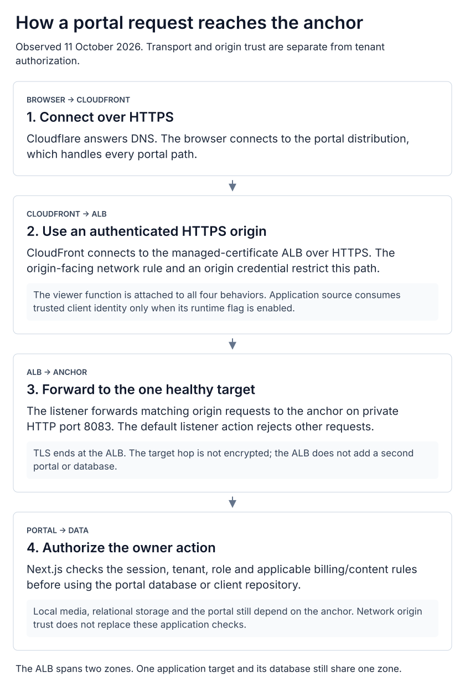

# The portal's HTTPS origin and trust boundaries

[System overview](../README.md) · [Request flow](request-flow.md) · [Failure domains](failure-domains.md) · [Evidence](diagram-evidence.md)

The portal now uses **CloudFront → HTTPS ALB → private HTTP → one EC2 anchor**.
The load balancer spans two Availability Zones; the application and database still
depend on one host. This improves the origin transport and access boundary without
establishing application failover or encryption on every hop.

  <a href="../diagrams/portal-ingress.svg"><picture>
    <source media="(max-width: 600px)" srcset="../diagrams/portal-ingress-mobile.svg">
    
  </picture></a>

1. **Resolve and connect.** Cloudflare provides DNS. The viewer's HTTPS connection
   terminates at CloudFront; Cloudflare is not an additional HTTP proxy.
2. **Reach the origin.** CloudFront makes a separate HTTPS connection to the ALB.
   ACM supplies the origin certificate. The ALB security group accepts HTTPS from
   the CloudFront origin-facing prefix list. That list covers CloudFront as a
   service; a secret origin header additionally identifies the intended distribution.
3. **Forward privately.** The listener's header rule forwards to the anchor on
   HTTP port 8083; its default action rejects unmatched requests. One target was
   registered and healthy in the October 11 read. The former direct CloudFront
   port rule was absent. The VPC-wide anchor rule remains, so this is not complete
   network segmentation or a claim of tenant isolation.
4. **Authorize the operation.** The portal still checks the caller's session,
   tenant membership, write role and relevant billing/content rules. Origin
   authentication does not authorize a user to edit a website.

The viewer-request function is attached to all four portal behaviors. The source
overwrites the trusted viewer-IP header, and the app consumes it only when its
runtime flag is enabled. This audit checked associations and source, not the
running container's environment or a fresh forged-header rejection test. Keep that
limit separate from the observed HTTPS route and healthy endpoint.

An ALB target-health check is not an automatic replacement host. If the anchor
fails, its application, database, local media and NAT remain unavailable until
recovered. [Backup monitoring](cloud-operations.md#independent-backup-monitoring)
can detect backup problems without using that host; it does not perform failover.

Recovery must preserve the ordering in the infrastructure origin runbook. Before
reopening an older origin path, disable trust in headers that path cannot
authenticate, then restore the reviewed route and verify the application. Do not
replay a stale full distribution configuration over newer changes.

**Evidence:** October 11 CloudFront behavior/origin metadata, ALB listener rule
shapes, target health and VPC security groups; infrastructure `stacks/portal-origin/`
and `runbooks/portal-origin.md`. No secret header values are published here.
