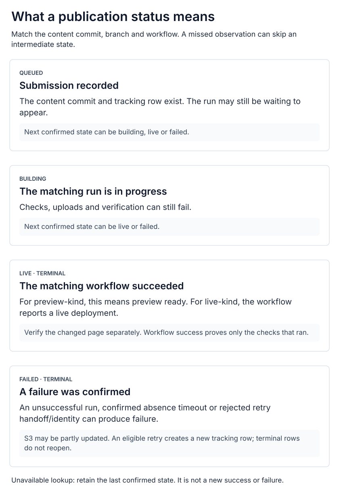

# How the portal knows a publication finished

[System overview](../README.md) · [Owner-to-live walkthrough](owner-publishing.md) · [Client CI/CD](client-site-cicd.md) · [Code release recovery](release-verification.md)

**The portal tracks the client's workflow for a particular content commit.** A saved draft,
a GitHub commit, HTTP 202 and a successful deployment describe different events. Even the
successful workflow's guarantee is limited by that client's post-deploy checks.

## What does each state prove?

| Evidence / state | Meaning | What remains unproven |
| :-- | :-- | :-- |
| Saved draft | Postgres accepted the document and its revision | No publication was requested by that save |
| Repository live-branch head | The source revision currently at the configured live branch | Its HTML may not have finished deploying; “live” in a source variable is not a delivery check |
| HTTP 202 / `queued` row | The portal recorded the content commit and publication target | A workflow may not have appeared yet |
| `building` | A matching workflow is in progress | Its build, upload or verification can still fail |
| `live`, kind `live` | The matching workflow completed successfully | For Showers, no exact-content body assertion or invalidation-completion wait |
| `live`, kind `preview` | The matching preview workflow completed successfully | This means preview ready; the public root was not promoted |
| `failed` | Confirmed run/tracking failure: unsuccessful run, confirmed absence timeout, or rejected exact-run retry handoff/identity | Some live S3 writes may already have happened |
| Status temporarily unavailable | The latest observation cannot be trusted or obtained | Neither success nor failure; retain the last confirmed state |

  <a href="../diagrams/publish-status.svg"><picture>
    <source media="(max-width: 600px)" srcset="../diagrams/publish-status-mobile.svg">
    
  </picture></a>

The portal can observe a completed run before it ever sees `building`. Status updates are
monotonic; delayed responses cannot turn a terminal record back into a pending one. A
permitted workflow retry creates a new tracking row. [Open the status guide diagram](../diagrams/publish-status.svg).

## How is a run matched?

The publication row binds a tenant, content SHA and preview/live kind. The content source
selects the repository, workflow filename and branch for that kind. Initial lookup filters
workflow runs by **SHA and branch**. A recorded run identity allows a direct run lookup;
the service checks the returned identity and rejects a mismatched SHA or branch. Exact-run
retries additionally bind the expected run attempt.

Preview branch reset and the content commit can produce different runs. A generic green
badge or the repository's most recent run cannot establish this publication's outcome.
The relevant code is `refreshPublish` in the [content service](https://github.com/JadenRazo/raizhost-app/blob/f3a405f7ddf07463f5436e699cdf2293225cba18/src/lib/content/service.ts)
and the [GitHub adapter](https://github.com/JadenRazo/raizhost-app/blob/f3a405f7ddf07463f5436e699cdf2293225cba18/src/lib/content/source/github.ts).

## Does GitHub push status back to the browser?

The inspected publication path uses **polling**, not a GitHub callback that directly updates
the owner interface. The browser requests
`GET /api/sites/{tenantId}/content/publishes/{publishId}`. The authenticated portal reconciles
GitHub's result into Postgres and returns the confirmed publication, or an unavailable
envelope with its last known state.

The [editor poller](https://github.com/JadenRazo/raizhost-app/blob/f3a405f7ddf07463f5436e699cdf2293225cba18/src/components/content-editor/publish-status.tsx)
checks about every six seconds while pending and online. Requests have a 15-second deadline;
three consecutive lookup failures pause automatic checks. Offline state pauses them too.
Manual status checking remains available; reconnect gets one automatic confirmation attempt.
These are lookup-failure limits, not a three-poll limit on a healthy running build.

Closing the tab stops that browser's checks, not GitHub Actions. The
[dashboard reconciliation](https://github.com/JadenRazo/raizhost-app/blob/f3a405f7ddf07463f5436e699cdf2293225cba18/src/lib/dashboard/publish-reconciliation.ts) reads stored
status first and has its own bounded foreground reconciliation of the latest pending live
publication: an initial check plus at most four sparse follow-ups, stopping at a terminal
result or two consecutive unavailable responses. This is not an always-running server sweep.

A **successful GitHub lookup confirming no run** can mark the publication failed after ten
minutes. A GitHub outage or malformed response is unavailable, so elapsed time alone during
an outage is not proof of failure. The timeout is evaluated when reconciliation runs.

## Where should I look when an update is stuck?

| Symptom | Evidence to inspect | Next action |
| :-- | :-- | :-- |
| Publish blocked before submission | Field errors, API rejection, draft revision and source head | Correct fields or resolve the conflict; do not overwrite a newer tab's draft |
| “Sent, but could not confirm” | The source commit and its workflow, then reloaded portal state | Git may have succeeded while DB confirmation failed; inspect before another publish |
| Preview reports a source conflict after committing | Preview branch/run and the newly moved live head | An earlier-source preview may exist; keep the tab's edits and review the refreshed source before another preview |
| Queued with no run | Tenant's repo/branch/workflow mapping, exact SHA, GitHub access and Actions run list | Check whether the intended push produced the expected workflow; do not substitute another green run |
| Status unavailable / offline | Portal response, browser connection and GitHub lookup availability | Recheck status; this creates no commit and does not rerun CI |
| Confirmed failed run | Exact run's failing step and target URL | Inspect possible partial writes; use an eligible exact-run retry or a reviewed recovery publication |
| Green live workflow, old page content | Intended URL, branch, SHA, uploaded HTML/assets, cache state and actual edited value | Verify served output and propagation; do not call the changed content verified from the badge alone |
| Preview looks right, live differs | Draft changes after preview, separate live commit and its run | Publish rebuilt the current draft; it did not promote the earlier preview artifact |

**Check status**, **retry deployment**, and **publish again** are different operations. A
status recheck only observes. When enabled and eligible, deployment retry reruns the exact
failed live run without a new content commit and creates a new tracking row; the server
revalidates source/run identity and retry limits. Do not assume this capability is enabled
for every source. A new Publish makes a new content commit and starts a new release.

History restore loads an earlier document into a draft. It cannot undo S3 writes by itself.
Review the restored values and publish them through the same checks. A failure after uploads
does not promise the previous website remains intact; [client CI/CD](client-site-cicd.md#what-does-failure-leave-behind)
identifies what may have changed at each stage.
