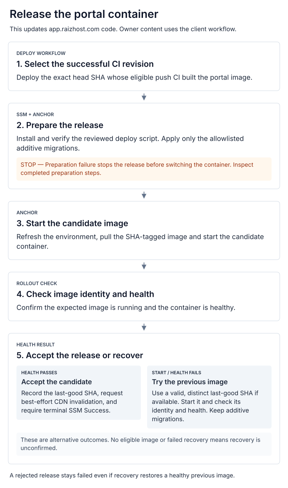

# Release verification and recovery

[System overview](../README.md) · [CI/CD](ci-cd.md) · [Authorization](authorization.md) · [Deployment destinations](deploy-flow.md)

A release can pass its authorization gates and still fail after changing production.
Verification checks the resulting behavior; recovery must account for the writes already
completed. The portal has automatic container rollback logic. Marketing and tracker release
workflows do not provide that same recovery mechanism.

## Portal rollout and rollback

  <a href="../diagrams/portal-rollout.svg"><picture>
    <source media="(max-width: 600px)" srcset="../diagrams/portal-rollout-mobile.svg">
    
  </picture></a>

1. Deploy selects the exact successful CI head SHA. SSM installs and verifies that revision's
   reviewed deploy script; allowlisted additive migrations run before the container switch.
   Preparation failures stop the release, and operators inspect which preparation steps ran.
2. The script refreshes the app environment, pulls the SHA-tagged image and starts it.
   Failures before container startup exit the script; the rollback branch covers candidate
   startup and health failures.
3. The rollout gate checks the **running image reference** and Docker health status.
   The inspected Compose health probe calls `/api/health`, whose HTTP success requires
   database reachability. The script does not compare the health response's JSON SHA.
4. A healthy candidate becomes `.last-good`. The script requests CloudFront invalidation
   as best effort, and the workflow requires terminal SSM `Success`. The later ops-file
   drift comparison only warns.
5. A rejected candidate can roll back only to a valid, distinct recorded last-good SHA.
   The previous image must start and pass the same image/health gate before recovery is
   reported. Missing recovery artifacts or failed health leave recovery unconfirmed.

Even a healthy rollback exits nonzero: the candidate was rejected, so its deployment remains
failed. Image rollback retains the additive database migrations and does not restore the
previous environment file. Migration compatibility checks in portal CI are therefore part
of making rollback viable. A database restore is a separate operation.

For release acceptance, also read the public health response and compare its reported SHA
to the intended commit, as in the [dated evidence](current-state.md). An origin container
health pass alone does not verify every edge route or an owner's complete editing journey.
[Open the rollout diagram](../diagrams/portal-rollout.svg).

## What each workflow verifies

| Target | Automated gate in inspected source | What success does not establish |
| :-- | :-- | :-- |
| Marketing | Requested SHA binding, deployment checks, successful S3 commands and invalidation request | No invalidation-completion wait or post-upload live smoke check; operator acceptance must inspect served output |
| Portal | Expected running image, container health, terminal SSM success | CDN invalidation is best effort; ops drift is warning-only; the script does not compare the public JSON SHA |
| Tracker | Web/poller update status, scheduler-shaped invocations and tier-result assertions, invalidation completion, database response, page empty-state checks and RSS item presence | This does not prove every record is correct or that each source keeps its expected cadence after the release |
| Connected client site | Its own workflow result for the content commit; Showers finishes with an HTTP HEAD smoke check | No exact-content assertion or invalidation wait in that example; an unavailable run lookup is not a confirmed failure. See [client CI/CD](client-site-cicd.md) and [publication status](publish-status.md) |

Tracker's final smoke checks test for specific empty-state strings and an RSS item; they
are useful regressions, not a complete assertion of every page's content. Its permission
preflight tests selected reads before writes, not every permission needed later.

## When a release fails

| Failure point | Recovery path |
| :-- | :-- |
| Before an artifact is written | Fix the failed gate and select the intended revision again; confirm whether preparation already changed configuration or schema |
| Portal candidate start/health | Automatic prior-image attempt described above; inspect both rollout and rollback outcomes |
| Marketing S3 upload or cleanup | Inspect served objects and completed steps, then redeploy a reviewed known-good revision; uploads and deletions are not an atomic swap |
| Tracker web, assets or tier update | Identify which components changed; repair or redeploy a reviewed revision across the web image and all pollers, then repeat verification |
| Client publication | Resolve the content/run state before retrying; a failed live S3 sync may already have changed public files |

Keep the recovery artifact and the verification evidence tied to the intended revision.
Production recovery follows the same effect-authorization rules as the original release.
The [evidence record](current-state.md) lists the inspected source; this documentation work
did not exercise a production rollback or database restore.

**Source basis:** portal `ops/anchor/deploy.sh`, Compose health probe and deploy workflow;
marketing/tracker deploy workflows; portal publication tracking.
