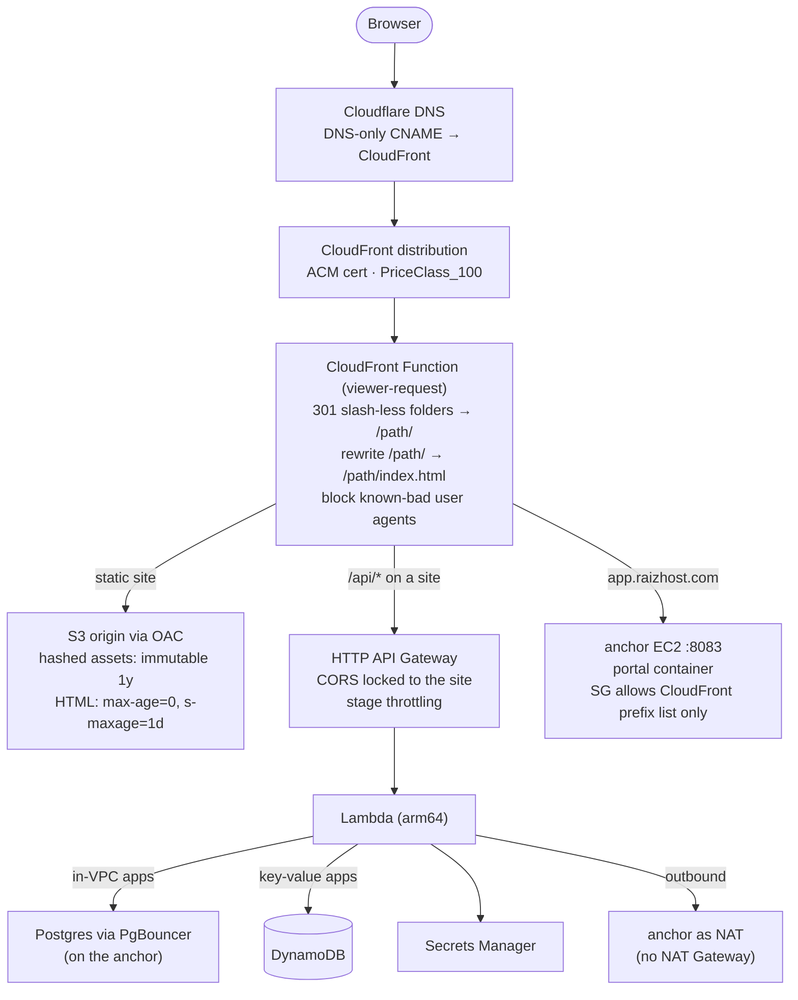

# Request flow

How a browser request reaches each kind of surface. Every public hostname resolves through
Cloudflare DNS (DNS-only CNAME) to its own CloudFront distribution; AWS hosts only origins.

## Three origin types

| Surface | Origin | Cold path | Notes |
|:--|:--|:--|:--|
| Static sites (marketing, demos, client sites, status) | S3 via Origin Access Control | S3 GET | Bucket policies allow only the owning distribution(s). The demo factory is mounted on **two** hosts (`demos.raizhost.com` and `raizhost.com/demos/`) from one bucket, which is what surfaced the shared-cache-key lesson. |
| Serverless apps (`llm.raizhost.com`, tenant apps, quote/CRM APIs) | HTTP API Gateway → Lambda | Lambda cold start (arm64 Next.js containers ~1 s; Go/Rust zip ~50 ms) | Next.js apps emit `s-maxage` so CloudFront serves HTML for most requests; Lambda sees only revalidations. |
| Client portal (`app.raizhost.com`) | Custom origin: the anchor's portal container | none (always on) | Origin request policy forwards all viewer headers; `X-Forwarded-Proto=https` is injected as an origin custom header. Auth pages are `no-store`; static chunks are immutable. |

## Why the edge does so much

CloudFront Functions run on every viewer request for microdollars and let the origins stay
dumb: canonical URLs are enforced before S3 sees the request, obvious bot traffic is dropped
before it becomes a Lambda invocation, and per-behavior cache policies decide what is shared.
The only time an origin is touched for a static site is a cache miss or an invalidation.
