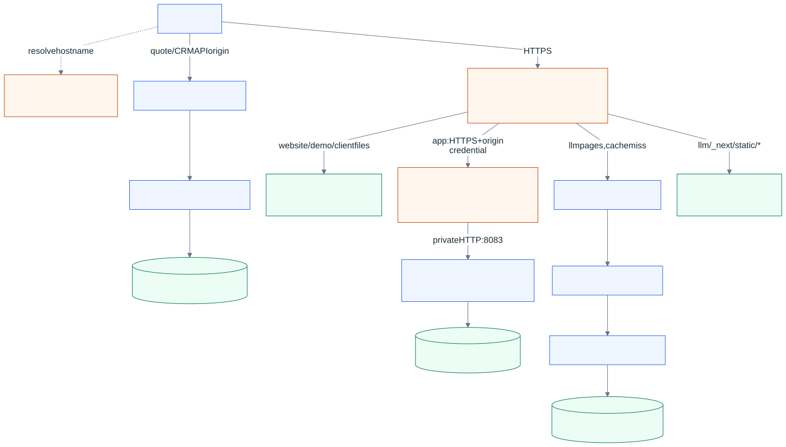

# Request flow

[System overview](../README.md) · [Website](raizhost-com.md) · [Owner portal](app-raizhost-com.md) · [LLM Tracker](llm-raizhost-com.md)

Cloudflare answers DNS queries for the RaizHost hostnames. The browser then connects to
CloudFront over HTTPS. DNS resolution and HTTP delivery are separate steps; Cloudflare's
DNS-only configuration does not put its HTTP proxy in front of the AWS origins.

  

## Which origin handles the request?

| Request | Origin path | State dependency |
| :-- | :-- | :-- |
| `raizhost.com` pages and built assets | CloudFront → marketing S3 bucket via OAC | Built files |
| Demo hostname or marketing `/demos/` mount | CloudFront → demo S3 bucket via OAC | Demo files |
| Published client website | Its CloudFront distribution → its S3 origin | Built client files; optional site APIs have their own routes |
| `app.raizhost.com` portal requests | CloudFront → Next.js container on anchor | Portal Postgres database, source repository for connected-site operations |
| `llm.raizhost.com` dashboard pages | CloudFront → HTTP API Gateway → Next.js web Lambda | Tracker Postgres through PgBouncer |
| Tracker `/_next/static/*` | CloudFront → private S3 asset origin | Hashed bundles |
| Marketing quote/CRM browser requests | Browser → separate HTTP API Gateway → Lambda | Respective DynamoDB table |

The quote and CRM APIs are called at their configured API origins. They are not marketing
CloudFront behaviors. A static page can initiate an API request without being hosted by
that API.

## Caching and trust boundaries

CloudFront can satisfy cacheable requests without contacting an origin. A cache miss or
revalidation follows the applicable origin route. Static hashed assets can have long cache
lifetimes; HTML, live dashboard data, authenticated pages, and health responses need
different policies.

OAC authorizes CloudFront to read private S3 objects. It is not an owner login mechanism.
Portal and administrative API handlers enforce their own authentication and authorization.
The portal's documented origin security group restricts ingress to CloudFront, while server
checks still protect tenant data.

For LLM Tracker, CDN caching and scheduled collection have separate clocks. Refreshing a
page may show cached data, and bypassing that cache still reads the latest stored records.
It does not force a provider poll.

## If a dependency is unavailable

| Dependency | Expected impact |
| :-- | :-- |
| Portal container | Editing and management may fail; already published S3 websites can still serve |
| Anchor Postgres/PgBouncer | Portal data and tracker database operations may fail; cached responses can hide the issue temporarily |
| Anchor outbound routing | In-VPC pollers may lose access to upstream sources |
| GitHub source/workflow API | Connected-site reads or publication confirmation may be unavailable |
| Quote/CRM API | The marketing pages may still load while their data operations fail |
| Resend | An accepted quote can remain stored even when its mail attempt fails |

These are dependency relationships, not an availability guarantee. The exact failure domain
depends on the deployed network and cache state. See [the evidence boundaries](current-state.md).
